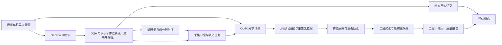

# 隧道巡检机器人仿真采集与内壁全图重建设计

版本：v0.4，2026-09-29。状态：阶段 A 已实现并通过验收（§13）；阶段 B–D 尚未实现。

## 1. 目标与范围

复现约 120 kg 轨道巡检机器人搭载旋转线阵相机和条形光源，在隧道内连续前进、连续旋转、按编码器信号采集的过程。第一阶段完成 **20 m 有效区间、上方 240° 内壁**的采集、拼接和全局优化，输出具有物理尺度的隧道内壁展开全图。

“完整全图”指上述有效区间内的完整可见内壁。底部 120° 是明确排除的区域，不通过补图伪装成实测覆盖。目标区域内若出现遮挡、漏采或重建空洞，必须输出有效性掩码并报告。

第一阶段包含轨道车、轨道、直线圆形隧道、内壁材质纹理、管片与板缝、裂缝、旋转光照、编码器触发、原始数据保存和重建。暂不包含两个面阵相机，也不以裂缝自动识别、真实电路仿真或隧道三维测量为交付目标。长度、半径和材质等参数可配置，后续扩展到 100–150 m。

## 2. 平台选择与总体架构

采用 **Gazebo（gz）负责机器人与环境动力学，自定义 OptiX 后端负责高速线阵成像**。参考相邻项目 [4WIDS_agv](../4WIDS_agv/) 的传感器调度、GPU 批处理、纹理流式加载和数据保存经验。

这一选择的主要依据是已有工程可复用，以及本项目的主要负担在高频成像、纹理访问和数据保存。更换 MuJoCo 或 Isaac Sim 并不能直接保证实现 4096 像素、数万行每秒的旋转线阵采集。本阶段不为更换动力学平台付出额外迁移成本；成像后端与动力学接口分离，保留将来替换平台的能力。

这里的 OptiX 是需要开发的独立成像后端，不是打开 Gazebo 某个渲染选项即可获得的线阵相机。当前平台选择是工程方案，接近实时的性能仍需实测。



动力学、成像、重建之间通过明确接口连接。Gazebo 不等待成像：动力学输出位姿流，成像端读取位姿流逐行渲染，允许落后跟随（§8.2）。成像可以使用真实仿真位姿生成图像；重建只能使用相机标定、可测编码器数据和名义隧道几何，不能读取真实轨迹或裂缝真值来修正结果。

安装参数区分真实值 T_true 与标定值 T_hat：成像和物理几何使用 T_true，重建只获得 T_hat，二者之差构成标定误差。T_true 只进入成像和 `evaluation/`。

## 3. 参数基线与确定程度

| 项目 | 第一阶段取值 | 来源或状态 |
|---|---|---|
| 有效采集长度 | 20 m | 已确定 |
| 隧道内半径 | 2.75 m | 常见地铁盾构内径 5500 mm（外径 6200 mm、管片厚 350 mm）；用户确定。阶段 A 验收用的是专利示例值 2.77 m |
| 机器人总质量 | 约 120 kg | 用户提供 |
| 相机 | DALSA Linea Mono 4k 26 kHz GigE，LA-GM-04K08A | 讨论使用的型号，实际固件仍待实机核对 |
| 每行像素 | 4096 | 用户最终确认，覆盖此前 4000 的说法 |
| 镜头 | 焦距 90 mm，对焦于名义壁面 2.75 m | 用户确定。像距约 93.05 mm 是薄透镜模型值，针孔模型的相机常数取像距而不是焦距；实际镜头的主平面位置会使其偏离，视场以标定为准 |
| 线阵在内壁上的纵向视场 | 约 0.852 m | 由镜头、对焦距离和 4096×7.04 μm 推得，不单独配置。原“0.8 m”是约数，恰好 0.8 m 需约 96 mm 的非标准焦距 |
| 每转车体前进距离 | 0.6 m | 已确定 |
| 扫描方式 | 连续前进、连续单向旋转 360° | 已确定 |
| 有效采集角度 | 上方 240°，底部 120° 不采 | 已确定 |
| 旋转编码器 | 独立安装，2500 PPR，A/B 四边沿计数 | 已确定的仿真方案；假定与扫描轴 1:1 |
| 电子倍分频 | 四边沿计数后 ×128÷15 | 使周向行距接近纵向像素间距。倍频取 2 的幂且不大于 128、分频 0–255 的范围参考 Linea Lite 手册，作为仿真假设；实机相机的范围待核对。阶段 A 用的是 ×64÷7 |
| 目标工作行频 | 50 kHz，相机受限时同步降速 | 按用户回忆的实测上限暂定，待核验；仿真按此运行 |
| 光心位置 | 名义位于隧道轴线，实际偏离 1–2 cm | 作为标定误差注入，见 §4.4 |
| 底盘里程编码器 | 1 个，A/B 差分 | 已确定；先假定 2500 PPR、四边沿计数，轮与编码器传动比默认 1 |
| 车轮直径 | 200 mm | 专利未明确，暂定工程估值 |
| 灯条实体长度 | 0.30 m | 用户提供 |
| 壁面光斑 | 纵向长 1.2 m、周向宽 0.12 m | 用户提供；以名义工作距离为基准 |
| 输出像素格式 | Mono8 起步 | 设计默认，可扩展更高位深 |
| 曝光时间 | 初始 8 μs，可配置 | 未标定的测试起点，需结合光照和拖影验证 |
| 轨距 | 1435 mm | 中国地铁标准轨距；左右轨头中心距约 1500 mm |
| 钢轨 | 60 kg/m：轨高 176 mm，轨头宽 73 mm，轨底宽 150 mm，轨腰厚 16.5 mm | TB/T 2341 型式尺寸；每米 60.64 kg |
| 轨道结构高度（轨面至隧道仰拱底） | 735 mm | 盾构区间板式道床设计实例：钢轨 176 + DTIII-2A 扣件 38 + 承轨台 25 + 轨道板 200 + 自密实混凝土 80 + 隔离层 4 + 仰拱基底 212 mm。各线路不同（另见地下线 650 mm 实例），作为配置项 |
| 道床板宽 | 2300 mm | 同一设计实例 |
| 隧道轴线高于轨面 | 2.015 m | 由内半径与轨道结构高度推得（2.75 − 0.735），不单独配置 |

四边沿是 A↑、A↓、B↑、B↓。A−、B−是差分互补信号，不是额外两相，也不再翻倍。2500 PPR 在本设计中专指每转 A 相完整周期数，避免与厂家“计数/转”的定义混用。

相机的产品标称行频、加速传输能力、外触发处理上限和实际可持续保存行频是不同约束。选定 ×128÷15 不等于已确认原实机固件支持全部计数路径；具体型号与固件上的四边沿处理、倍分频次序及范围保留为硬件核对项。仿真先明确实现本文所定义的行为，不混用其他 Linea 系列手册结论。

## 4. 扫描几何、行频和速度

### 4.1 坐标与门控

世界坐标 x 沿轨道前进，y 为横向，z 向上。隧道轴线为 `(x, 0, z_c)`，轨面为 z=0，`z_c = R − h_track`（内半径减轨道结构高度，名义 2.015 m）。轨道车立于钢轨上，立柱高度按“扫描轴落在隧道轴线上”反推，而不是独立给定，使 Gazebo 模型、光学场景和重建名义几何来自同一组参数。相机名义光心位于轴线上，旋转轴平行 x，线阵像素方向沿隧道纵向。

定义顶部为扫描角 θ=0，朝 +y 方向旋转为正；径向方向为 `(0, sinθ, cosθ)`。第 k 圈在实际扫描轴经过 `−120°+360°k` 时开始采集，经过 `+120°+360°k` 时结束。两个底部侧向感应器承担这两个门控事件；扫描轴继续通过余下 120°，不会停转或反向。

门控使用实际运动产生的交越事件，不能仅使用指令角度。边界统一采用起点包含、终点不包含，以曝光中心时刻判定一行归属。感应器延迟、抖动、安装偏差默认关闭，后续可配置。

### 4.2 编码器与采样间隔

令 P=2500、四边沿系数 Q=4、倍频 M=128、分频 D=15，则名义有效行数/整圈为：

```text
N = P × Q × M / D = 1280000/15 ≈ 85333.3333 行/转
纵向视场 = 4096 × 7.04 μm × 2.75 m / 93.045 mm ≈ 0.8523 m（薄透镜模型值，实际以标定为准）
原始纵向像素间距 gx ≈ 0.2081 mm
周向长度 C = 2π×2.75 ≈ 17.2787596 m
周向行间距 gθ = C/N ≈ 0.2025 mm（gθ/gx ≈ 0.973）
```

该设置周向采样比纵向密约 2.7%，两者接近但并非完全相等。倍分频的选择依据：行距只由每转行数决定，比例 gθ/gx = 2π×像距/(N×像元尺寸)，在像距固定（对焦不变）时与半径无关。若每次按新半径重新对焦，像距 v = fR/(R−f) 随之变化，比例间接依赖半径，但影响很小：R 由 2.75 m 变为 2.95 m 并重新对焦时，像距只变 −0.23%。在相机允许范围内，最接近 1 的组合是 ×128÷15（0.973）；其次是 ×8÷1（1.038，周向欠采样）；原 ×64÷7 为 0.908。镜头焦距和对焦距离本身有 1–2% 的公差，不追求更精确的匹配。原始行距应按实际时间和姿态处理，最终再重采样到等距展开网格。

像素单位约定：“原始像素”指传感器纵向像素在名义壁面上的间距（约 0.208 mm），“输出像素”指展开图网格（0.2 mm，§9.1）；阶段 A 的结果使用阶段 A 配置的像素（0.1953 mm）。文中给出像素数时注明是哪一种。

倍频产生更多曝光时刻，不产生更多独立的编码器位置测量。原始旋转编码器仅有 10000 个计数/转；倍率大于 1 的中间时刻依赖电子时序生成。

`N` 不是整数，不能每圈强行截断成固定行数。倍分频相位在非采集区继续运行，门控只决定是否曝光保存。每段有效弧的平均行数为 `N×2/3≈56888.89`，实际整数行数随相位和门控变化。

### 4.3 旋转与行走同步

设 f 为有效采集弧内的瞬时行频，n 为转速（转/秒），v 为车速：

```text
n = f/N
rpm = 60f/N
v = 0.6n = 0.6f/N
```

| 行频 | 转速 | 车速 |
|---|---:|---:|
| 50 kHz | 35.15625 rpm | 0.3515625 m/s |
| 40 kHz | 28.125 rpm | 0.28125 m/s |
| 30 kHz | 21.09375 rpm | 0.2109375 m/s |
| 26 kHz | 18.28125 rpm | 0.1828125 m/s |

50 kHz 时每圈约 1.70667 s，其中采集 1.13778 s、底部空转 0.56889 s。采集期间车体前进 0.4 m，底部空转期间前进 0.2 m。相邻圈在相同扫描角上的纵向视场重叠为 `0.852−0.6≈0.252 m`，约 30%。

若相机可持续行频降低，旋转和行走一起按比例降低，保持每圈前进 0.6 m，不能只减小其中一个速度。起停阶段采用共同的平滑速度因子，并记录实际同步误差。底部空转仍保持同一运动规律。

仿真计算跟不上则是另一个问题，不改变场景：动力学照常按仿真时钟运行，行频仍为 50 kHz；成像落后跟随，只推迟完成时间（§8.2）。不跳行、不改时间戳。

### 4.4 安装偏差与标定误差

光心名义位于隧道轴线，旋转轴平行 x。实际安装偏差作为标定误差注入：成像使用真实值，重建只获得名义值 0 及先验标准差。按来源分别建模，因为它们的图像效果和可观测性不同：

| 偏差 | 试验量级 | 图像上的效果 | 重叠匹配可观测性 |
|---|---|---|---|
| 光心沿视线偏离旋转轴 e | 1–2 cm | 壁面距离变为 R−e，纵向尺度整体偏约 0.7%/2 cm | 有条件：2 cm 使重叠偏移由约 2884 变为约 2905 原始像素，但每圈前进量由 0.6 m 变为约 0.6044 m 也产生同样变化。仅有独立尺度或可靠标定先验时可估计，不与轮径尺度同时自由求解 |
| 旋转轴相对隧道轴平移 dy、dz | 1–2 cm | 距离随 θ 正弦变化；周向位置最多偏约 2 cm | 纵向尺度随 θ 变化的部分与常量尺度可分离，可估 dy、dz；周向偏移是整条线的共同平移，由几何模型推算 |
| 旋转轴相对 x 轴倾斜 β | 约 1 mrad | 纵向偏移随 θ 正弦变化，幅值 Rβ≈2.75 mm，约 13 原始像素（约 14 输出像素） | 主体是整条线的共同平移，重叠匹配基本不可观测；随 θ 变化，环缝直线度形状先验可以发现（§9.2） |
| 光心切向偏移 | 小量 | 整条线的周向常量偏移 | 共同平移，重叠匹配不可观测；与扫描角零位耦合，依赖门控感应器和标定先验 |
| 线阵扭转 | 小量 | 行内剪切，线两端周向反向偏移 | 重叠匹配可发现 |

重叠匹配观测到的纵向尺度是每圈前进量与壁面距离之比，e、轮径尺度和视场标定三者耦合。独立尺度来源包括轮径标定先验、视场标定先验，以及管片环宽设计值（环缝间距，需计入施工偏差）。

量级是拟定的敏感性试验档位，不是真机装配精度。1 个输出像素（0.2 mm）约对应 72.7 μrad 角度误差，1 个原始纵向像素（0.208 mm）约对应 75.7 μrad。按 7.04 μm 像元、90 mm 焦距、对焦 2.75 m 估算，f/4 时弥散不超过 1 个传感器像元的景深约 ±2.5 cm，2 cm 距离偏差约产生 0.8 个像元的弥散，因此镜头模糊按实际物距计算（§7）。周向绝对位置误差不影响拼接，但须进入质量报告。

## 5. 轨道车与执行机构

参照 [机器人结构专利](CN111185894A.pdf) 建立可参数化模型：车架、四轮、两只对角布置的驱动轮及被动轮、侧向导向机构、立柱、旋转扫描头、相机、光源和滑环。整车质量约 120 kg，各部件质量和惯量采用合理初值并保证总量一致。

底盘车轮驱动和扫描头驱动采用独立关节及独立执行器，以控制器维持速度比例；不假定存在轮轴与扫描轴之间的物理传动联动。扫描头电机可以有减速机构，但本方案的 2500 PPR 编码器定义在扫描输出轴侧、传动比为 1。若以后改装在电机侧，必须显式计入减速比，避免重复计算倍率。

车轮编码器量化实际被测轮转角。专利中编码器经齿轮连接被动轮，传动比作为配置参数，默认 1。以 200 mm 轮径和 10000 计数/转估算，里程增量为 `π×0.2/10000≈0.0628319 mm/计数`。这是轮上里程，不直接等于真实位移；轮径误差、打滑、导向接触等可造成偏差。

先验证平顺行驶与居中扫描，再加入轮轨扰动和安装偏差。初期可以通过明确的轨道运动约束降低接触求解成本，但必须标注此简化，不把受约束基线称为完整轮轨动力学验证。后续再用轮轨接触和侧向导向验证动力学稳定性。

扫描头架在细长八字支架顶上，刚体模型不会自然产生支架晃动。在支架与扫描头之间提供弹簧阻尼关节或时间相关、平滑连续的随机振动输入，默认关闭，作为误差档位逐项打开。0.1° 姿态误差在壁面约 4.8 mm，约 23 原始像素（24 输出像素）。真机扫描头没有 IMU，重建不使用姿态测量。无真机振动测量时，这些档位称为敏感性试验，不宣称代表真机。

碰撞模型采用简化几何，视觉和光学模型保留实际遮挡结构。滑环第一阶段实现外观、质量惯量和理想电气连通语义，保证连续旋转无电缆角度限制；暂不仿真电压波形、接触噪声或通信误码。

车架尺寸、轮距、轴距、扫描头径向偏置和各部件质量分配均为待细化建模项，集中放入配置，不伪称专利给定值。

## 6. 隧道、轨道与缺陷场景

### 6.1 几何与边界

有效输出区间固定为 x∈[0,20] m。在两端增加建模和采集缓冲段，用于加减速、约 0.85 m 视场以及螺旋扫描起止覆盖。初始场景可取 x∈[−1.5,21.5] m，但实际缓冲长度需由加速度与逐角度覆盖计算确认，不将这一初值作为覆盖保证。

匀速采集从有效区间之前开始，在有效区间之后结束。用射线覆盖图确认所有目标纵向位置和有效扫描角均被采样后，再裁出 20 m，避免只让车体中心走满 20 m 就停止。

隧道建立内壁、管片环、纵向分块、环缝和纵缝，支持错缝布置。

国内标准没有规定管片的环宽和分块角度，这些由工程“综合确定”。天津地方标准 DB/T 29-272-2019 给出以下构造规定，作为建模约束：

- 分块：数块标准块、两块邻接块和一块封顶块。封顶块插入角斜率不宜大于 1/6。
- 拼装：宜错缝，也可通缝；拼装检验时相邻环环面间隙、纵缝相邻块间隙均不大于 2.0 mm，成环内径偏差 ±2 mm。
- 厚度：外径 5–8 m 时宜为 0.05–0.06 D，不小于 250 mm；外径 6.2 m 对应 310–372 mm，与 350 mm 一致。
- 接缝内侧：管片边缘设倒角；接缝面退缩高度不小于 2 mm、宽度不小于 20 mm；内侧预留嵌缝槽，槽宽不宜小于 10 mm、深不宜小于 25 mm、深宽比不小于 2.5（第 9.4.2 条）。第 10.4.2 条进一步规定：环向和纵向边均设嵌缝，槽深宜为 25–55 mm，单面槽宽宜为 5–10 mm；嵌缝作业区和嵌填部位按防水要求确定；嵌填应密实、平整，槽口混凝土缺损须用聚合物水泥砂浆等修补。
- 单块精度：宽度 ±0.5 mm，弧长和弦长 ±1.0 mm，厚度 +3/−1 mm。
- 内弧面有螺栓手孔、注浆/吊装孔、定位孔（杯口直径不小于 100 mm）和凹陷不超过 8 mm 的标识框，这些都是纹理中真实存在的局部结构。
- 楔形量：外径 6–8 m 常用 30–90 mm。采用通用楔形环时，直线隧道同样由楔形环旋转组合而成（第 9.2.2 条），环面并不严格垂直于轴线。本项目第一阶段简化为等宽环，环面垂直于轴线；这是建模简化，不代表直线段没有楔形环。

相机看到的板缝形态取决于嵌缝状态，不能一律建成裸露深槽，否则会系统性夸大阴影。板缝按三种状态配置，并记录在缺陷真值中：

- 未嵌填：裸露嵌缝槽加倒角，槽口约 10–20 mm（约 50–100 原始像素），深 25–55 mm，阴影明显。
- 已嵌填：嵌缝材料密实、平整，与混凝土有色差和光泽差，槽口只剩倒角形成的浅凹。
- 局部破损：嵌缝脱落、缺损或砂浆修补，形成局部深槽和不规则边缘。

嵌缝部位和各状态的比例作为场景配置，由防水设计决定哪些缝嵌填。基准场景同时包含三种状态。

分块默认值采用李围、何川（2003）对外径约 6 m 地铁单线盾构隧道的研究结论：每环分 6 块，封顶块 K 10°、邻接块 L 2×67°、标准块 B 3×72°，纵向连接螺栓 10 处、按 36° 等角布置。该文还给出日本统计：外径 5–7 m 时每环 5–7 块，以 6 块最多；弧长多为 3.2–4.5 m；6–8 块时 K 块插入角多为 7.5°–17.5°。这个统计范围作为分块配置的合理区间。这是方案研究，不是某条线的实际管片（其算例为内半径 2.7 m、厚 0.30 m、环宽 1.0 m）。环宽取现代地铁常见的 1.2 m，标为暂定工程值。上述取值在配置和结果中均标明来源，取得具体线路资料后再替换。

道床和两条钢轨参与可见性与碰撞计算：两根 60 kg/m 钢轨按 1435 mm 轨距铺设在宽 2300 mm 的板式道床上，钢轨断面按标准型式尺寸建模（光学几何可用多边形近似轮廓，碰撞只需轨头）；道床顶面、扣件和钢轨高度按上表的轨道结构高度分配。管片长度、分块数、缝宽与凹深先作为工程配置，按参考图片或实物资料校准。

### 6.2 内壁纹理与缺陷

圆柱纹理以纵向位置 x 和周向弧长 q=Rθ 为物理坐标。连续基底纹理、色差、污渍和修补痕迹应覆盖完整场景，避免每块管片机械重复同一贴图，使拼接退化为不真实的简单匹配或产生重复纹理歧义。

采用多级、分块纹理并流式加载，为跨块采样保留边缘冗余，沿用 4WIDS 道路方案。纹理有效分辨率与目标约 0.2 mm 采样相匹配，避免将整条隧道烘焙成一张超大常驻显存贴图。按像素面积折算，20 m 隧道壁的纹理需求与 4WIDS 100×10 m 道路相当；扩展到 150 m 时约为其 9 倍，届时再评估。

裂缝采用矢量表达，按像素覆盖面积计算，使宽度真值精确，不用三角网格烘焙细裂缝。4WIDS v7 曾因裂缝尖端的细碎三角形造成假错位。

板缝使用真实浅槽或等效可验证的光学几何，体现凹陷、遮挡和阴影。裂缝同时支持反照率变化与浅表凹陷，记录位置、走向、宽度、深度及实例编号。基准场景布置 0.2、0.5、1、2 mm 等宽度，以及跨管片、接近板缝、低对比度和分叉裂缝；0.1 mm 可作为极限测试，不预先保证可辨。

几何像素间距不等于实际分辨率。曝光拖影、镜头模糊、亚像素覆盖、噪声和照度都会影响裂缝可见性。细裂缝必须进行像素面积采样或等效抗混叠验证，不能依赖偶然命中一条射线。

光学材质使用反照率及粗糙度等参数，不能把随相机转动的灯光阴影直接画进固定贴图。光学网格与简化碰撞网格分离，但来源于相同场景参数。

## 7. 条形光源与相机成像

30 cm 灯条与相机刚性连接、同步旋转。通过等效透镜后的角度配光模型，在名义距离 2.75 m 的壁面形成约 1.2 m×0.12 m 光斑；包含有限光源尺寸、照度分布、入射角、距离变化和遮挡。第一阶段不追踪特殊透镜内部每次折射。

约 0.85 m 线阵视场位于 1.2 m 光斑长轴内，名义两端各留约 0.17 m。光斑宽度沿扫描周向。灯条与光心的实际安装偏置、光斑定义采用半高宽还是有效照度范围，以及总光功率均需后续校准。

先用相对辐射量建立可重复成像，再按实测亮度、曝光、增益与饱和情况标定。未校准前不能声称仿真给出了真实照度或真实信噪比。

相机模型包括标定射线方向、曝光时间、曝光期间的运动积分、随实际物距变化的镜头模糊、响应、饱和、暗电平与可配置噪声。初始理想模型用于验证几何，之后逐项启用退化。50 kHz 对应 20 μs 行周期，8 μs 仅是曝光测试起点；该速度下周向曝光位移约 0.081 mm（约 0.4 行），需在成像验证中检查。

OptiX 每批生成多行，每行按其独立时间戳求相机和光源姿态。曝光内多时间采样、像素内采样及光源采样通过收敛测试选择，不能用一个批次位姿代替整批运动。

## 8. 编码器、时序与数据链路

### 8.1 触发模型

1. 根据实际扫描轴运动检测 A/B 边沿交越，生成带方向的量化计数和时间戳。
2. 四边沿计数形成 10000 计数/转输入，通过 ×128÷15 时序模块生成行触发事件。
3. 使用因果的周期估计与相位累加生成中间时刻；启动、变速、停转和超时行为写入配置与日志。第一阶段不声称完全复刻未公开的相机固件逻辑。
4. 两个门控感应器决定触发是否成为有效曝光。一段上方 240° 构成一张逻辑扫描图，行数由实际事件决定。
5. 对每次有效曝光生成像素并保存其时间、序号、编码器关联信息和状态。

提供理想等角度触发模式仅用于验证基准，并与上述编码器合成时序模式明确区分。不能读取真实角度，在加减速时悄悄补出完美等角度脉冲后声称这是硬件倍频效果。不得通过复制图像行代替倍频后的新曝光。

### 8.2 动力学与成像解耦

动力学频率初始可取约 1 kHz，再根据关节和振动频带验证。利用跨步关节轨迹求交越时刻和曝光位姿，避免要求整车物理世界按 50 kHz 步进。插值对高频运动的误差需单独验证。

Gazebo 不等待成像。动力学按仿真时钟步进，输出实际关节与车体位姿流，写入缓冲并存档；成像端读取位姿流，按行插值求曝光位姿，允许任意落后。位姿流约 1 kHz，20 m 整趟仅数 MB，缓冲整趟轨迹没有负担。

- 成像跟不上时只推迟完成时间，不拖慢动力学，不改变场景行频。Gazebo 跑完后同一进程继续运行，直到成像完成，无需人工后处理。
- 动力学中没有依赖成像像素的环节。相机 50 kHz 上限是场景参数，由控制器在轨迹侧处理，与算力无关。
- 存档位姿流可在不重跑 Gazebo 的情况下重新成像，用于改光照、曝光、纹理或画质档位。位姿流、触发时序、场景、成像配置、随机种子和运行环境（GPU 型号、驱动、构建版本）均相同时，成像结果应逐字节一致。
- 噪声和采样随机数按行号与像素编号生成（计数器型随机数），不依赖批大小和线程调度。
- 运行中的预览取自成像输出，允许滞后数秒。

旋转头、车体和光源的姿态来自同一仿真时钟。暂停、恢复、成像滞后或批大小变化不应改变触发序列及采集结果的几何关系。

### 8.3 保存与缓冲

原始数据按连续行块写入，逻辑扫描图通过索引关联，不要求单个内存数组容纳一整圈，也不把固定 4096 行存储块当成独立几何照片。尾部不足整块的数据必须保存。

有界队列连接成像、读回和磁盘写入。队列满时成像等待写盘，不回压动力学。禁止静默丢行。主动测试丢行时需显式标记缺失区间。

数据组织建议：

```text
session/
  config/          # 参数快照、标定、随机种子、软件和场景版本
  raw/             # 原始像素块、完整性校验
  metadata/        # 逐行时刻/序号、编码器事件、门控、曝光和状态
  reconstruction/  # 初始结果、匹配、优化参数与最终成果
  evaluation/      # 与重建输入隔离的真实位姿流（也用于重新成像）、T_true、缺陷和参考展开图
  logs/            # 运行日志和性能统计
```

元数据需区分可观测量和仿真真值。原始像素不可被优化结果覆盖；中间产物可重建，最终结果可追溯到源行。

## 9. 拼接与全局优化

### 9.1 初始几何展开

线阵的一行对应一个独立采集时刻，连续有效弧形成斜向扫描条带。不能将每段采集直接当成普通面阵照片，用单一二维变换拼接。

在光心严格居中、理想针孔、相机线方向与 x 平行的圆柱基线中，像素 u 的纵向视角为 α(u)，车体位置为 s(t)：

```text
x(u,t) = s(t) + R tan α(u)
q(t) = R θ(t)
```

一般情况按标定射线与名义内壁求交，处理安装偏差、倾斜和径向偏置。初始 s(t) 来自名义轮径及轮编码器，θ(t) 来自扫描编码器和触发时序估计。真实位姿仅供评估。

初始展开保留覆盖次数、无效区和采样来源。最终输出采用 0.2 mm 的等距网格。它比原始纵向间距 0.208 mm 和周向行距 0.2025 mm 都略细，是轻度加密的输出网格，不代表真实分辨率提高。最终取值在阶段 D 确定。不能直接把原始行列当成正方形像素。

### 9.2 重叠匹配与约束

利用相邻圈约 30% 纵向重叠建立匹配。先低分辨率估计粗偏移，再以局部纹理、角点或图像块进行精配准；使用编码器预测范围与几何约束排除重复板缝误匹配。

低纹理、过曝、阴影和高度重复区域需降低权重或报告匹配不足，不能通过任意形变强行取得视觉连续。裂缝标注和真值展开图不参与匹配或优化。

板缝除了是误匹配风险，也提供两类约束，均从图像中检测，权重需考虑管片施工偏差：

- **形状先验**：环缝在展开图上应为直线，纵缝沿周向对齐。只能发现随位置变化的畸变（如旋转轴倾斜 β 造成的环缝正弦弯曲），发现不了整幅图的均匀平移或统一周向偏移，平移后环缝仍直、纵缝仍对齐。
- **尺寸或位置约束**：已知环宽（环缝间距）、分块角度、已测位置标记。有可靠设计值或测量值时，才能约束纵向尺度和绝对位置。

### 9.3 全局优化

优化量采用低维、物理可解释的表示，包括纵向轨迹平滑修正、轮径尺度修正、扫描角相位、必要的触发延迟、安装偏差（e、dy、dz、β，见 §4.4）以及扫描头姿态的时间连续修正。具体开放哪些变量由可观测性决定，不同时无约束优化所有参数。

相邻圈在同一扫描角的观测时间相差一个转动周期 T（50 kHz 时约 1.70667 s），同一壁面点在两圈中分别位于线阵两端。每圈重复的误差并不都不可观测，按其对一条扫描线的作用区分：

- **整条线的共同平移**（纵向或周向）：两次观测平移相同，重叠残差为零，不可观测。包括旋转轴倾斜 β 的主体、dy/dz 引起的周向偏移、编码器偏心，以及周期为 T 或 T/n 的扫描头沿纵向或周向的平移晃动。
- **尺度变化**：线阵两端偏移不同，重叠匹配可见，但与轮径尺度、视场标定耦合（§4.4），只有随 θ 或时间变化的相对部分可直接估计。
- **线阵转动、扭转等姿态误差**：线两端反向偏移，重叠匹配部分可见。

不可观测的共同平移中，随位置变化的部分可由板缝形状先验发现；均匀的部分只能由尺寸或位置约束及标定先验确定，没有这类信息时作为绝对位置不确定度报告。

扫描头没有 IMU，支架振动只能由重叠匹配和板缝约束间接修正。姿态修正的节点间距受观测密度限制，不在无观测区依赖平滑先验补出短周期运动。残差按振动档位报告，给出在哪些振动幅度和频率下重建超过误差指标，据此提出允许振动范围；判定真机支架是否满足要求需要真机振动实测。

目标函数结合重叠区匹配残差、轮编码器里程约束、扫描编码器角度约束、轨迹平滑项和标定先验，使用鲁棒损失降低错误匹配影响。固定起始坐标及必要尺度基准，防止整体漂移自由度。

仅靠条带间匹配不能恢复所有绝对尺寸，隧道半径、视场标定和轮径先验误差必须进入报告。优化不能以任意拉伸改变裂缝宽度来掩盖错误。

先输出未经接缝融合的几何拼接，用于检查重复、错位和裂缝连续性。几何通过后可进行受限亮度补偿及窄带融合。最终依据优化后的映射从原始数据进行一次重采样，避免多次插值损失细节。

## 10. 数据量与输出格式

以 4096 像素、Mono8、50 kHz 计算，不含元数据和文件开销：

| 指标 | 估算 |
|---|---:|
| 有效弧内瞬时像素吞吐 | 204.8 MB/s |
| 包含底部空转的长期平均吞吐 | 约 136.53 MB/s |
| 一段上方 240° 逻辑扫描图 | 约 233.02 MB |
| 车体中心匀速走过 20 m 的仿真时间 | 约 56.89 s |
| 对应平均原始像素量 | 约 7.77 GB |

以上是十进制单位；实际完整任务包含缓冲段、加减速、元数据和中间结果，容量需另留余量。更高位深按实际存储字节数增加。204.8 MB/s 不是宣称普通 GigE 能无压缩传输该速率；本阶段仿真先保存传感器原始输出，若研究真实通信瓶颈，再单独加入压缩与链路模型。

上方 240° 弧长约 11.51917 m。以 0.2 mm 等距输出，宽高约为 **100000×57596 像素**，单通道约 5.76 GB，不能默认输出普通 TIFF 或单张 PNG。

最终交付采用分块 BigTIFF 或等价的分块多分辨率格式，并生成可快速浏览的预览图。输出包括：内壁全图、有效性与覆盖掩码、质量/置信度图、源条带映射、坐标与尺度说明、优化参数及质量报告。先进行分块重建与存储，不要求全部中间图同时驻留内存。

## 11. 性能设计与复用边界

动力学实时率与成像性能分别报告。成像性能报告三项：

- 活跃采集阶段（上方 240°）的处理能力，以行/秒计，与 50 kHz 比较；
- 整段采集的实际平均吞吐。只采 240°，完全实时时整圈平均约 33333 行/秒；
- 从启动到全部原始数据落盘的总耗时，以及动力学结束时的成像滞后。

首轮目标为成像进度实时率（已完成成像的仿真时长/墙钟耗时）≥0.95。若不能达到，报告实测值和瓶颈，成像完成时间相应延后。不能以省略写盘、跳过照明或丢行的结果代替完整系统性能。

优先采用批量射线追踪、GPU 常驻缓冲、异步读回、连续块写盘和局部纹理驻留。每个位置附近需要覆盖旋转可见的整个有效圆周，不能照搬平面道路项目仅按地面局部矩形加载纹理的方法。GUI 使用低刷新率，与采集解耦。

4WIDS 的已有记录显示，简化成像微基准与包含真实纹理、数据流的链路性能存在明显差距，且部分记录不包含 Gazebo 动力学。因此既不把微基准视为本项目实时保证，也不把特定配置下的链路吞吐视为不可突破的上限。

可复用传感器调度、OptiX 管线组织、缓冲队列、纹理缓存和记录工具；需重做圆柱 UV、曲面法线、旋转光照、扫描轴时间轨迹、传感器门控和隧道拼接。道路成像中的平面求交、平面纹理坐标与固定向下照明假设不能直接保留。

依次测量纯成像、成像加写盘、完整 Gazebo 链路。记录活跃采集行频、整圈平均吞吐、动力学实时率、成像吞吐与滞后、峰值显存/内存、队列水位、写盘带宽和缺行数，同时保留分阶段耗时。

## 12. 开发守则（相邻项目教训）

来源：4WIDS [现行教训](../4WIDS_agv/docs/LESSONS.md)（下称 WL#n）与[完整调查](../4WIDS_agv/docs/archive/maintenance/LESSONS_20260923_FULL.md)（W#n），climbot [隐蔽故障记录](../climbot_sim/docs/INCIDENTS.md)（C#n）。只列会改变本项目做法的条目。两个项目反复出现的共性是：测试全绿、摘要通过、图像看起来对齐，但实际加载的代码、被测的量或验收的范围不是以为的那个。

### 12.1 证据链：代码、构建、运行分三层

- 采集启动前自检实际加载的插件和后端：已安装插件中的 OptiX/CUDA 符号、实际库路径、构建参数，结果写入 `session/config/`。后端缺失即拒绝采集，不提供静默回退（W#25：构建参数静默关掉 CUDA，测试仍全绿；WL#4：Gazebo 仍加载旧插件）。
- 改了 CMakeLists 先重建再测，核对测试总数的变化等于新增数（W#26）。工具脚本导入已安装包，不把源码目录插到 `sys.path` 最前（W#19）。
- 每个阶段（采集、展开、匹配、优化、重采样、评估）发布结果时自动写入代码版本、参数和输入/输出哈希，摘要校验整条哈希链，溯源字段不手填（C#15）。分析旧数据读 `session/config/` 的归档配置，不读当前仓库配置（W#24）。

### 12.2 验收不能真空通过

- 空掩码、NaN、零特征、零匹配、零有效行一律报错。判据分通过、失败、不可测三态，不可测单独计数并上报占比（C#15、W#17）。
- “低于阈值即异常”的判据要按被测量本身归一化，例如弱纹理区匹配得分低是信号不足，不是错位（W#15 审计阈值条）。
- 门限失败时先分解误差来源；只能扣除能指明且已测量的物理量，不拟合掉常数项（W#27）。
- 方法冻结后新采数据验收；失败批次修复后重新冻结并重采，不直接转为盲验（WL#3）。
- 看图前先确认边界是数据边界还是画布裁剪边界；成图输出每条带的实际范围、行数和是否被裁剪（W#29、W#31）。
- 人工复核清单覆盖承诺的每类对象（各宽度裂缝、板缝、弱纹理区、接缝）；原图已清理的不能称已复核（WL#5）。

### 12.3 测试设计

- 真值独立构造：解析圆柱求交、CPU 参考实现、按公式正演的合成图；不用被测代码生成期望值（W#32）。
- 每个修复配回归测试，并把修复改回旧行为，确认测试会失败（W#33）。
- 测耦合项时，公式中其他参数取非零值。e、β、轮径尺度和角度零位要同时非零；全零或只设单个参数测不出漏乘（W#36）。
- 同一关系有两份实现时，用关系断言（相等、包含或互逆）测试，例如正反映射、源行读取窗口与实际采样需求、成像射线模型与重建射线模型（W#35）。
- 至少一组测试跑到实际规模（20 m、完整 240°、真实行数），检查内存与耗时（W#32）。
- 优化器每新增一个自由度（e、dy/dz、β、姿态样条），先确认它有无独立于已有退化方向的证据；没有则加先验锚定，并用明显错误的假匹配测试它不会被吸收（W#34）。
- 系统偏置不能当噪声加权。轮径、零位等偏差场景至少取负、名义、正三档；只跑名义值看不到随条件变化的偏置（W#30）。

### 12.4 仿真与场景

- OptiX 光学面、Gazebo 视觉面和重建名义半径由同一参数生成；贴图层厚度或法向偏移不得使被拍面偏离重建投影面（C#14：1.25 mm 贴膜造成 +4566 ppm 尺度误差）。
- 圆柱 UV 的 θ 与 x 方向用实际渲染的不对称标记验证，不能只验证生成器公式（W#6：UV 镜像）。
- 成像缺陷先查网格和材质，再怀疑拼接（WL#6）。
- Gazebo 参数要证明目标引擎确实读取。弹簧阻尼、接触和摩擦参数各做一次量级 A/B，同时对照一个已知生效的参数（W#14：`<ode><kp>` 在 DART 下无效且不报警）。
- 轮轨碰撞用基本几何体，不用三角网格；隧道壁高清几何只进 OptiX，不进碰撞（W#5、W#16：网格内部边造成错误法向和冲量）。
- 试验夹具中的渐入段、扰动和边界条件做成显式参数，正式场景不得静默继承（W#13）。
- 平场和光度标定靶使用与隧道壁相同的材质和着色路径（C#16）。
- 暂停恢复时，运动曲线从当前状态重新规划，只把静止时段计入期限顺延（C#8）。

### 12.5 时间、数据与运行环境

- 本机为 WSL：定时和看门狗用仿真时间或 steady clock，不用可回拨的系统时钟；等待用绝对截止时刻，不用循环次数或固定睡眠（C#2、C#3、C#7）。
- 大块图像不走 ROS/DDS，由成像进程直接写盘；ROS 只发低频预览和状态。确需发布超过 512 KiB 的可靠话题时，配置写端共享内存（C#12）。
- 行身份以行号和编码器序号为准，不按到达顺序关联；异步请求携带身份，超时后退休该请求的所有回路（C#6、C#10）。
- 批量写盘时保留逐块回读校验；耐久化耗时逐次记录，不依赖周期采样日志（C#11）。
- 尾块和合法丢弃必须有显式记录，离线端按记录核验连续性，不放宽连续性检查（W#9）。
- 性能按位置、阶段和启用组件切片报告，不只看全程平均（W#13）；按整链计时（WL#7）；改写语言前先测热路径（W#20）。
- 沿用 4WIDS 的私有 Mesa 修复、WSL 下 OptiX 运行库包装和崩溃转储设置；接入整车前先跑最小 OptiX 初始化与射线探针；长任务监控 RSS（W#1、W#3、W#11）。
- 并行测试的偶发失败不归为时间噪声，必须找到根因（C#4）。长任务输出写入 `/tmp` 下的独立日志，只读摘要与关键指标。
- 完整原图、中间图和掩码可达数十 GiB；清理前确认复核完成，并记录从原图重建的成本（WL#7）。

## 13. 实施阶段与验收

### 阶段 A：几何与时序最小闭环

建立短圆柱、理想轨道车和扫描轴，完成 4096 像素射线、独立编码器、×64÷7（阶段 A 实施时的配置）、上下门控和逐行记录。以解析圆柱及独立 CPU 计算抽样校验 GPU 求交。验证分数行数、跨圈相位、起停、暂停恢复、成像滞后和批大小变化。

验收：事件数量与配置一致；时间单调；无重复或缺失有效行；门控方向正确；恒速下满足 0.6 m/转；理想展开与参考坐标一致；满足 §8.2 复现条件时重新成像结果逐字节一致，改变批大小不改变结果。后端自检（§12.1）通过，阶段溯源链可校验。

实现记录（2026-09-29）：

- 倍分频模型：新到达的正向边沿（超过已达最大计数）即子节拍 64c；以上一边沿周期外推 63 个中间子节拍，下一边沿到达前未发出的丢弃；起步、边沿间隔超过 `max_period_s` 或反转后不插值。所有未成为曝光的格点行都写入 `dropped_rows` 并注明原因，门内不存在未记录的缺行。这是本设计定义的行为，不代表相机固件。
- 重建端用单调三次插值（PCHIP）由编码器边沿求任意时刻位置。线性插值在减速至静止的行上误差达 0.24 像素，PCHIP 为 0.018 像素（阶段 A 像素 0.1953 mm）。
- gz-sim 在调用系统前已把 `simTime` 推进到本步末，速度指令须取该时刻的剖面值。DART 按半隐式欧拉积分（步内位移 = 步长 × 步末速度），Hermite 插值与之在加速段最多约差 0.01 个阶段 A 像素。
- 验收区分三件事：数据已全部落盘；计划运动已跑完（Gazebo 首步即核对实际步长等于 `sample_period_s`，不符则拒绝运行，不生成会话）；门内事件记账完整与有效采集区无缺行分开判定。有效区由配置 `acceptance.valid_x_m` 给出，区外起停缓冲段的丢行只计数报告。
- 渲染前的逐行任务队列有界（`render.max_queued_batches`），成像落后时由时序展开等待，位姿流继续缓存，不影响动力学。
- 溯源链：渲染阶段记录配置、位姿流、世界文件的内容哈希；验收逐环校验配置源 → 真值与可观测配置（逐字段由配置源重新推导比对）→ 运行输入 → 后端自检 → 存档位姿流；会话完成时在 `session.json` 记录各描述文件的内容哈希，事后被改动即判失败。有效区须为有限递增区间，区内没有曝光时判不可测而不是通过。其溯源记录列出读取的全部文件和对比会话。
- 结果：`stage_a.yaml` 的 7.8 s 剖面（起步、巡航、停车）共 218308 行。有效区 x∈[0.25, 1.9] m 内 159999 行无缺失；停车与结束缓冲段 27 条门内丢行（无周期估计 18、流结束 9）均有记录。运动学与 Gazebo 两种位姿源均通过全部检查，其中包括与独立 Python 参考实现逐项一致，以及理想展开 P95 0.0002、最大 0.018 个阶段 A 像素。仿真中途暂停、离线重新成像和改变批大小的结果均与原会话逐字节一致。Gazebo 动力学实时率 1.00，成像进度实时率 0.994，动力学结束后 0.05 s 全部落盘；纯成像约 45 万行/秒。以上为解析圆柱、无照明的阶段 A 场景，不代表阶段 B 以后的性能。

### 阶段 B：场景与照明

完成轨道车视觉/碰撞模型、20 m 加缓冲的隧道、管片、板缝、非重复纹理、可控裂缝及随动条光。验证光斑尺寸、覆盖、阴影、曝光拖影和抗混叠，并通过多采样对比选择成像质量档位。

验收：几何尺度正确；目标区域可见性明确；细节跨纹理块连续；裂缝宽度与其参考定义一致；光照与模型旋转同步。

### 阶段 C：20 m 原始采集

先做短时满负载性能测试，再运行完整 20 m 任务。若相机行频受限，按第 4 节同步降速；若算力受限，保留仿真时序，成像落后跟随、完成时间延后。记录完整运行日志，结束后检查摘要与完整性，异常时再定位日志。

验收：20 m×240° 名义目标覆盖完整；原始数据和元数据可重放；无静默丢行；峰值资源可控；给出动力学实时率、成像吞吐和成像完成滞后，不要求未经验证就承诺成像实时跟上 50 kHz。

### 阶段 D：拼接与全局优化

完成初始展开、重叠匹配、全局优化、分块重采样与成果浏览。分别使用理想基线和受控误差场景，比较优化前后几何误差。受控误差包括轮径偏差、角度零位偏差、速度波动、适量噪声、安装偏差 e/dy/dz/β（§4.4）、编码器偏心和支架振动档位（§5）；一次引入一种，再测试组合。对每圈重复的共同平移类误差（§9.3），须单独验证板缝形状先验能否发现随位置变化的部分，均匀部分是否如实报告为绝对位置不确定度；对 e 与轮径尺度的耦合，须验证尺度先验是否足以区分。

验收：输出 20 m 上方 240° 全图及全部辅助成果；用独立真值检查纵向尺度、周向位置、接缝错位、环缝直线度、裂缝连续性与宽度保持。初步几何目标：理想基线接缝误差 P95≤0.5 个输出像素，用于发现实现错误；受控误差场景下清晰且可匹配区域接缝误差 P95≤3 个输出像素，整体纵向尺度误差≤0.5%。这些是待基线验证的工程目标，不是既有实测结果。

不确定或低纹理区域必须单列占比与误差，不能通过排除困难区域宣称整图满足指标。几何质量以未融合结果衡量，并人工检查典型接缝、裂缝和弱纹理区；视觉平滑不能替代几何正确。

## 14. 尚待细化但不阻塞起步的事项

- 真机车轮、车架、扫描头和灯条安装尺寸；先采用集中配置的工程初值。
- 实机相机固件的编码器解码及倍分频细节；先实现本设计明确规定的时序模型。
- 镜头标定、曝光、增益、光斑定义及绝对光度；先完成几何与相对光度基线。
- 扫描头支架刚度与振动频谱；无真机测量前只作敏感性试验档位。
- 真实管片尺寸、板缝形态与表面素材；先使用可重复生成、尺度明确的基准场景。
- 实测硬件资源与完整链路吞吐；通过阶段 C 决定成像质量档位，并给出成像吞吐。

这些参数不需要现在全部追溯真机才能开始开发，但每个假设都必须进入配置和结果报告，避免与已经确定的参数混淆。

## 15. 参考资料

- [CN111185894A：一种隧道轨道检测机器人](CN111185894A.pdf)：机构与采集装置参考。未据此认定扫描头与底盘存在物理联动。
- [CN112270672A：基于线阵相机的隧道管片表观图像处理方法](CN112270672A.pdf)：扫描几何和图像处理参考。原示例中 4000 像素、70 kHz 等参数不覆盖本次确定的 4096 像素及 ×128÷15 配置。
- [4WIDS 当前状态](../4WIDS_agv/docs/CURRENT_STATUS.md)：已有工程状态与性能背景。
- [4WIDS 拼接设计](../4WIDS_agv/docs/STITCHING_DESIGN.md)：连续条带、可测输入、全局修正和质量评估的设计参考；具体几何需改为本项目的圆柱螺旋扫描。

- 轨道尺寸来源：[60 kg/m 钢轨型式尺寸](https://baike.lcgt.cn/entry.html?id=1760)（引 TB/T 2341）；[地铁板式道床轨道结构高度 735 mm 分解](https://www.guimei8.com/10839.html)；[北京大兴机场线道床结构高度实例](https://www.guimei8.com/17214.html)。均为二手资料，实际线路以设计文件为准。
- 管片分块：李围，何川．地铁区间盾构隧道管片衬砌设计分块的探讨．隧道建设，2003，23(6)：1–2，5。
- 管片构造：[天津市快速轨道交通盾构隧道设计规程 DB/T 29-272-2019](https://zfcxjs.tj.gov.cn/sylm/gabsycs/xxbzgfgh/202010/W020201029539664858051.pdf) 第 9 章；国家标准 GB/T 22082-2024《预制混凝土衬砌管片》全文未取得。
