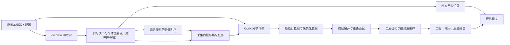

# 隧道巡检机器人仿真采集与内壁全图重建设计

版本：v0.9，2026-10-01。

状态：阶段 A 已验收。阶段 B 已完成场景、照明、接触动力学和光学标定，有 3 m 短程完整采集验收，当前画质已获用户确认并冻结为后续采集基线；RViz 任务界面已实现并通过短程联调；完整 20 m 采集（阶段 C）、拼接与全局优化（阶段 D）尚未实现。阶段 B 的现行配置、操作命令和验收结果见 [docs/STAGE_B.md](docs/STAGE_B.md)；开发守则见 [docs/DEVELOPMENT_RULES.md](docs/DEVELOPMENT_RULES.md)；过程记录和旧版设计见 [docs/history/](docs/history/README.md)。

本文只写设计要求和现行方案。标为“工程假设”“暂定”的数值不代表实测或真机参数。

## 1. 目标与范围

复现约 120 kg 轨道巡检机器人搭载旋转线阵相机和条形光源，在隧道内连续前进、连续旋转、按编码器信号采集的过程。第一阶段完成 **20 m 有效区间、上方 240° 内壁**的采集、拼接和全局优化，输出具有物理尺度的隧道内壁展开全图。

“完整全图”指上述有效区间内的完整可见内壁。底部 120° 是明确排除的区域，不通过补图伪装成实测覆盖。目标区域内若出现遮挡、漏采或重建空洞，必须输出有效性掩码并报告。

第一阶段包含轨道车、轨道、直线圆形隧道、内壁材质纹理、管片与板缝、裂缝、旋转光照、编码器触发、原始数据保存和重建。暂不包含两个面阵相机，也不以裂缝自动识别、真实电路仿真或隧道三维测量为交付目标。长度、半径和材质等参数可配置，后续扩展到 100–150 m。

## 2. 平台选择与总体架构

采用 **Gazebo（gz）负责机器人与环境动力学，自定义 OptiX 后端负责高速线阵成像**。参考相邻项目 [4WIDS_agv](../4WIDS_agv/) 的传感器调度、GPU 批处理、纹理流式加载和数据保存经验。

这一选择的主要依据是已有工程可复用，以及本项目的主要负担在高频成像、纹理访问和数据保存。更换 MuJoCo 或 Isaac Sim 并不能直接保证实现 4096 像素、数万行每秒的旋转线阵采集。本阶段不为更换动力学平台付出额外迁移成本；成像后端与动力学接口分离，保留将来替换平台的能力。

这里的 OptiX 是需要开发的独立成像后端，不是打开 Gazebo 某个渲染选项即可获得的线阵相机。当前平台选择是工程方案，接近实时的性能仍需实测。



动力学、成像、重建之间通过明确接口连接。Gazebo 不等待成像：动力学输出位姿流，成像端读取位姿流逐行渲染，允许落后跟随（§8.2）。成像可以使用真实仿真位姿生成图像；重建只能使用相机标定、可测编码器数据和名义隧道几何，不能读取真实轨迹或裂缝真值来修正结果。

安装参数区分真实值 T_true 与标定值 T_hat：成像和物理几何使用 T_true，重建只获得 T_hat，二者之差构成标定误差。T_true 只进入成像和 `evaluation/`，隔离方式见 §8.4。

## 3. 参数基线与确定程度

| 项目 | 第一阶段取值 | 来源或状态 |
|---|---|---|
| 有效采集长度 | 20 m | 已确定 |
| 隧道内半径 | 2.75 m | 常见地铁盾构内径 5500 mm（外径 6200 mm、管片厚 350 mm）；用户确定。阶段 A 验收用的是专利示例值 2.77 m |
| 机器人总质量 | 约 120 kg | 用户提供 |
| 相机 | DALSA Linea Mono 4k 26 kHz GigE，LA-GM-04K08A | 讨论使用的型号，实际固件仍待实机核对 |
| 每行像素 | 4096 | 用户最终确认，覆盖此前 4000 的说法 |
| 镜头 | 焦距 90 mm，对焦于名义壁面 2.75 m | 用户确定。像距约 93.05 mm 是薄透镜模型值，针孔模型的相机常数取像距而不是焦距；实际镜头的主平面位置会使其偏离，视场以标定为准 |
| 线阵在内壁上的纵向视场 | 约 0.852 m | 由镜头、对焦距离和 4096×7.04 μm 推得，不单独配置。原“0.8 m”是约数，恰好 0.8 m 需约 96 mm 的非标准焦距 |
| 每转车体前进距离 | 0.6 m | 已确定 |
| 扫描方式 | 连续前进、连续单向旋转 360° | 已确定 |
| 有效采集角度 | 上方 240°，底部 120° 不采 | 已确定 |
| 旋转编码器 | 独立安装，2500 PPR，A/B 四边沿计数 | 已确定的仿真方案；假定与扫描轴 1:1 |
| 电子倍分频 | 四边沿计数后 ×128÷15 | 使周向行距接近纵向像素间距。倍频取 2 的幂且不大于 128、分频 0–255 的范围参考 Linea Lite 手册，作为仿真假设；实机相机的范围待核对。阶段 A 用的是 ×64÷7 |
| 目标工作行频 | 28.444444 kHz，车速 0.2 m/s、转速 20 rpm | 当前仿真工作点；相机实测上限暂按 50 kHz，受限时同步降速 |
| 光心位置 | 等效投影中心位于旋转轴，旋转轴名义与隧道轴重合；当前偏差为 0 | 1–2 cm 仅为后续敏感性试验，不是当前实际安装偏差，见 §4.4 |
| 镜头畸变 | 边缘 +0.6% 枕形，k1=0.006 | 有意放大的仿真假设，用于检验标定与校正，见 §7.3 |
| 扫描轴装配高度 | 底座参考 0.3 m + 轴相对底座 1.715 m | 由隧道轴线高度推得，配置 `robot.*`，见 §5.1 |
| 底盘里程编码器 | 两个弹簧压紧的测量轮各 1 个（每根钢轨一个），A/B 差分 | 测量轮直径 80 mm，在后轴之后，竖直滑轨导向；两个前轮驱动，后轮从动承重；2500 PPR、四边沿计数，传动比默认 1，见 §5.2；理想模式仍用后轮编码器 |
| 车轮直径 | 200 mm | 专利未明确，暂定工程估值 |
| COB 发光尺寸 / 散热器平面尺寸 | 20×20 mm / 80×80 mm | 用户修正确认；特制透镜整形成条光 |
| 壁面光斑 | 纵向长 1.2 m、周向宽 0.12 m | 用户提供；以名义工作距离为基准 |
| 光源相对相机位置 | 同轴并排，轴向 −115 mm，径向/切向偏移为 0，两光轴平行 | 当前工程选值；光斑尺寸按半高全宽解释 |
| 带缓冲的模型长度 | 23 m，x∈[−1.5,21.5] m | 当前实际网格；有效输出仍为 [0,20] m |
| GUI 成像实时率 | ≥0.6，车速固定 0.2 m/s | 用户确定的当前约束；现行资产 3 m 短程实测约 0.994 |
| 输出像素格式 | Mono8 起步 | 设计默认，可扩展更高位深 |
| 曝光时间 | 初始 8 μs，可配置 | 未标定的测试起点，需结合光照和拖影验证 |
| 轨距 | 1435 mm | 中国地铁标准轨距；左右轨头中心距约 1500 mm |
| 钢轨 | 60 kg/m：轨高 176 mm，轨头宽 73 mm，轨底宽 150 mm，轨腰厚 16.5 mm | TB/T 2341 型式尺寸；每米 60.64 kg |
| 轨道结构高度（轨面至隧道仰拱底） | 735 mm | 盾构区间板式道床设计实例：钢轨 176 + DTIII-2A 扣件 38 + 承轨台 25 + 轨道板 200 + 自密实混凝土 80 + 隔离层 4 + 仰拱基底 212 mm。各线路不同（另见地下线 650 mm 实例），作为配置项 |
| 道床板宽 | 2300 mm | 同一设计实例 |
| 轨道竖向不平顺 | 平直 / 2 mm / 5 mm（10 m 弦最大矢度），北京地铁实测谱形状 | 仿真真值档位，依据 GB/T 50299-2018、DB11/T 718-2016，见 §6.1 |
| 车轮柔性 | 聚氨酯包胶轮，静压缩量 0.2 mm（敏感性 0.15/0.4 mm） | 用户确认为包胶轮；刚度无实测，按 DART 实际压缩量标定，见 §5.1 |
| 隧道轴线高于轨面 | 2.015 m | 由内半径与轨道结构高度推得（2.75 − 0.735），不单独配置 |

四边沿是 A↑、A↓、B↑、B↓。A−、B−是差分互补信号，不是额外两相，也不再翻倍。2500 PPR 在本设计中专指每转 A 相完整周期数，避免与厂家“计数/转”的定义混用。

相机的产品标称行频、加速传输能力、外触发处理上限和实际可持续保存行频是不同约束。选定 ×128÷15 不等于已确认原实机固件支持全部计数路径；具体型号与固件上的四边沿处理、倍分频次序及范围保留为硬件核对项。仿真先明确实现本文所定义的行为，不混用其他 Linea 系列手册结论。

## 4. 扫描几何、行频和速度

### 4.1 坐标与门控

世界坐标 x 沿轨道前进，y 为横向，z 向上。隧道轴线为 `(x, 0, z_c)`，轨面为 z=0，`z_c = R − h_track`（内半径减轨道结构高度，名义 2.015 m）。轨道车立于钢轨上，立柱高度按“扫描轴落在隧道轴线上”反推，而不是独立给定，使 Gazebo 模型、光学场景和重建名义几何来自同一组参数。相机名义光心位于轴线上，旋转轴平行 x，线阵像素方向沿隧道纵向。这里的光心专指理想成像模型的等效投影中心，不是镜头前表面或传感器平面。以投影中心为头部原点、朝壁面为 +z：传感器平面位于 z=−93.045112782 mm（由同一成像常数推导），镜头前玻璃暂估位于 z=+35 mm，镜筒跨过旋转轴。上述传感器位置采用薄透镜基线，不代表实际多组镜头的入瞳至传感器距离；前玻璃外形偏移不参与射线投影。

定义顶部为扫描角 θ=0，朝 +y 方向旋转为正；径向方向为 `(0, sinθ, cosθ)`。车体 +x 为前方、+y 为左侧。初始扫描头朝正下方 θ=180°，按正方向先空转 60° 到右下方 θ=240°（等价于 −120°）；0.6 m/圈下这段空转对应约 0.1 m 行程。第 k 圈在实际扫描轴经过 `−120°+360°k` 时开始采集，经过 `+120°+360°k` 时结束。两个底部侧向感应器承担这两个门控事件；扫描轴继续通过余下 120°，不会停转或反向。

门控使用实际运动产生的交越事件，不能仅使用指令角度。边界统一采用起点包含、终点不包含，以曝光中心时刻判定一行归属。感应器延迟、抖动、安装偏差默认关闭，后续可配置。

### 4.2 编码器与采样间隔

令 P=2500、四边沿系数 Q=4、倍频 M=128、分频 D=15，则名义有效行数/整圈为：

```text
N = P × Q × M / D = 1280000/15 ≈ 85333.3333 行/转
纵向视场 = 4096 × 7.04 μm × 2.75 m / 93.045 mm ≈ 0.8523 m（薄透镜模型值，实际以标定为准）
原始纵向像素间距 gx ≈ 0.2081 mm
周向长度 C = 2π×2.75 ≈ 17.2787596 m
周向行间距 gθ = C/N ≈ 0.2025 mm（gθ/gx ≈ 0.973）
```

该设置周向采样比纵向密约 2.7%，两者接近但并非完全相等。倍分频的选择依据：行距只由每转行数决定，比例 gθ/gx = 2π×像距/(N×像元尺寸)，在像距固定（对焦不变）时与半径无关。若每次按新半径重新对焦，像距 v = fR/(R−f) 随之变化，比例间接依赖半径，但影响很小：R 由 2.75 m 变为 2.95 m 并重新对焦时，像距只变 −0.23%。在相机允许范围内，最接近 1 的组合是 ×128÷15（0.973）；其次是 ×8÷1（1.038，周向欠采样）；原 ×64÷7 为 0.908。镜头焦距和对焦距离本身有 1–2% 的公差，不追求更精确的匹配。原始行距应按实际时间和姿态处理，最终再重采样到等距展开网格。

像素单位约定：“原始像素”指传感器纵向像素在名义壁面上的间距（约 0.208 mm），“输出像素”指展开图网格（0.2 mm，§9.1）；阶段 A 的结果使用阶段 A 配置的像素（0.1953 mm）。文中给出像素数时注明是哪一种。

倍频产生更多曝光时刻，不产生更多独立的编码器位置测量。原始旋转编码器仅有 10000 个计数/转；倍率大于 1 的中间时刻依赖电子时序生成。

`N` 不是整数，不能每圈强行截断成固定行数。倍分频相位在非采集区继续运行，门控只决定是否曝光保存。每段有效弧的平均行数为 `N×2/3≈56888.89`，实际整数行数随相位和门控变化。

### 4.3 旋转与行走同步

设 f 为有效采集弧内的瞬时行频，n 为转速（转/秒），v 为车速：

```text
n = f/N
rpm = 60f/N
v = 0.6n = 0.6f/N
```

| 行频 | 转速 | 车速 |
|---|---:|---:|
| 50 kHz | 35.15625 rpm | 0.3515625 m/s |
| 40 kHz | 28.125 rpm | 0.28125 m/s |
| 30 kHz | 21.09375 rpm | 0.2109375 m/s |
| **28.444444 kHz（当前）** | **20 rpm** | **0.2 m/s** |
| 26 kHz | 18.28125 rpm | 0.1828125 m/s |

50 kHz 时每圈约 1.70667 s，其中采集 1.13778 s、底部空转 0.56889 s。采集期间车体前进 0.4 m，底部空转期间前进 0.2 m。相邻圈在相同扫描角上的纵向视场重叠为 `0.852−0.6≈0.252 m`，约 30%。

若相机可持续行频降低，旋转和行走一起按比例降低，保持每圈前进 0.6 m，不能只减小其中一个速度。起停阶段采用共同的平滑速度因子，并记录实际同步误差。底部空转仍保持同一运动规律。

当前工作点每圈 3 s，顶部采集 2 s、底部空转 1 s；空间行距不变。仿真计算跟不上时，动力学照常按仿真时钟运行，工作行频仍为 28.444444 kHz；成像落后跟随，只推迟完成时间（§8.2）。不跳行、不改时间戳。

### 4.4 安装偏差与标定误差

光心名义位于隧道轴线，旋转轴平行 x。实际安装偏差作为标定误差注入：成像使用真实值，重建只获得名义值 0 及先验标准差。按来源分别建模，因为它们的图像效果和可观测性不同：

| 偏差 | 试验量级 | 图像上的效果 | 重叠匹配可观测性 |
|---|---|---|---|
| 光心沿视线偏离旋转轴 e | 1–2 cm | 壁面距离变为 R−e，纵向尺度整体偏约 0.7%/2 cm | 有条件：2 cm 使重叠偏移由约 2884 变为约 2905 原始像素，但每圈前进量由 0.6 m 变为约 0.6044 m 也产生同样变化。仅有独立尺度或可靠标定先验时可估计，不与轮径尺度同时自由求解 |
| 旋转轴相对隧道轴平移 dy、dz | 1–2 cm | 距离随 θ 正弦变化；周向位置最多偏约 2 cm | 纵向尺度随 θ 变化的部分与常量尺度可分离，可估 dy、dz；周向偏移是整条线的共同平移，由几何模型推算 |
| 旋转轴相对 x 轴倾斜 β | 约 1 mrad | 纵向偏移随 θ 正弦变化，幅值 Rβ≈2.75 mm，约 13 原始像素（约 14 输出像素） | 主体是整条线的共同平移，重叠匹配基本不可观测；随 θ 变化，环缝直线度形状先验可以发现（§9.2） |
| 光心切向偏移 | 小量 | 整条线的周向常量偏移 | 共同平移，重叠匹配不可观测；与扫描角零位耦合，依赖门控感应器和标定先验 |
| 线阵扭转 | 小量 | 行内剪切，线两端周向反向偏移 | 重叠匹配可发现 |

重叠匹配观测到的纵向尺度是每圈前进量与壁面距离之比，e、轮径尺度和视场标定三者耦合。独立尺度来源包括轮径标定先验、视场标定先验，以及管片环宽设计值（环缝间距，需计入施工偏差）。

量级是拟定的敏感性试验档位，不是真机装配精度。1 个输出像素（0.2 mm）约对应 72.7 μrad 角度误差，1 个原始纵向像素（0.208 mm）约对应 75.7 μrad。按 7.04 μm 像元、90 mm 焦距、对焦 2.75 m 估算，f/4 时弥散不超过 1 个传感器像元的景深约 ±2.5 cm，2 cm 距离偏差约产生 0.8 个像元的弥散，因此镜头模糊按实际物距计算（§7）。周向绝对位置误差不影响拼接，但须进入质量报告。

## 5. 轨道车与执行机构

### 5.1 结构与装配

以 [机器人结构专利](CN111185894A.pdf) 为底盘参考、用户补充的新版真机图片为立柱和扫描架参考，建立可参数化模型：车架、四轮、两只前驱动轮及两只后从动轮（用户确认，替代专利的对角布局）、四个侧向导向轴承、立柱、旋转扫描头、相机、光源和滑环。整车质量约 120 kg，各部件质量和惯量采用合理初值并保证总量一致。未测的车架尺寸、组件外形和质量分配集中配置，均不伪称专利给定值。

外观：主色橙白，去掉两侧地面相机及其支架。扫描头架在近乎竖直的双立柱顶上，立柱顶部间距 0.62 m；立柱中部各以斜撑连接底座（前柱接左侧横梁、后柱接右侧横梁），斜撑直径暂取 24 mm。固定 U 架长约 0.56 m，底边中心在轴下 215 mm，托盘全周最小几何间隙约 18.1 mm（几何值，不是考虑挠曲后的安全裕量）。沿旋转轴依次布置 COB 光源、相机、滑环；滑环外壳固定、转子随头部转动。轴距暂取 0.7 m，轮径 200 mm。

装配高度由两个配置字段给出：`robot.base_reference_z_m` 为名义轨面至 base 坐标系的高度，`robot.scan_axis_height_m` 为 base 坐标系至扫描轴的高度。阶段 B 取 0.3 m 和 1.715 m，扫描轴落在隧道轴线上（z=2.015 m）；阶段 A 世界取 0.25 m 和 1.72 m。世界生成、成像和独立参考计算共用这两个字段，真实车体姿态绕 base 坐标系变换安装向量。两个 Gazebo 插件启动时核对 SDF 中 base、head 的实际位姿，与配置不符即拒绝运行。缺少该字段的旧配置按底座 0.3 m 推算，新配置应显式写出。

轮轨按专利 [0038]：轨顶行走轮，加轨头内侧竖轴导向轴承。四个轴承半径暂取 25 mm、宽 24 mm，中心在轨顶下 19 mm，名义侧向间隙 0.2 mm；不加额外轮缘或防抬升抱轨结构。

碰撞模型采用基本几何体：接触模式共 10 个刚体（启用车轮柔性时另加 4 个轴座），四个行走轮和四个导向轴承有独立关节与碰撞体，底盘保留 2 个碰撞体；散热片、支架细节和隧道壁不设碰撞体。理想模式为 6 个刚体。视觉和光学模型应保留影响成像的遮挡结构；当前 OptiX 光学场景只含内壁和板缝，不含机器人自身，几何间隙检查不能替代镜筒挡光验收。滑环只实现外观、质量惯量和理想电气连通，保证连续旋转无电缆角度限制，不仿真电压波形、接触噪声或通信误码。

**车轮柔性**：真机行走轮为较硬的聚氨酯包胶轮。每个轮子经一个带弹簧阻尼的竖向滑动关节连到车架（车架—轴座—车轮；驱动在轴座与车轮之间的转动关节上）。DART 忽略接触刚度参数，所以柔性只能放在关节上。缺少实测数据，以"静载下的实际压缩量"作为工程假设（默认 0.2 mm，敏感性档位 0.15/0.4 mm），阻尼比 0.2；导向轴承为钢轴承，保持刚性。1 ms 步长下 DART 的隐式弹簧阻尼与接触约束同解时，实际压缩量比 载荷/刚度 大 1.3–2 倍，并含约 0.08 mm 的数值部分，所以写入 SDF 的刚度由隔离车辆模型在 DART 中标定，使实际静压缩量等于假设值（`ssb_tools.wheel_stiffness`）。0.1 mm 以下的压缩量在 1 ms 步长下无法实现。没有模拟受压后滚动半径的变化、包胶层滚动阻力和接触斑变形。

支架和车体按刚性处理（用户决定），车体振动只来自轨道不平顺（§6.1）。刚体模型不会自然产生支架晃动；如需支架振动档位，可在支架与扫描头之间提供弹簧阻尼关节或时间相关、平滑连续的随机振动输入，默认关闭。0.1° 姿态误差在壁面约 4.8 mm，约 23 原始像素（24 输出像素）。真机扫描头没有 IMU，重建不使用姿态测量。没有真机振动测量时，这些档位只称为敏感性试验，不宣称代表真机。

### 5.2 驱动、里程与扫描同步

底盘车轮驱动和扫描头驱动采用独立关节及独立执行器，由控制器维持速度比例，不假定轮轴与扫描轴之间存在物理传动联动。扫描头电机可以有减速机构，但 2500 PPR 编码器定义在扫描输出轴侧、传动比为 1；若改装在电机侧，必须显式计入减速比，避免重复计算倍率。

现行接触模式（直轨）：刚体轮轨库仑摩擦接触（轮轨摩擦系数 1，导向 0.5），不做柔性轮胎形变；没有世界直线约束；轨顶可带竖向和左右差动不平顺（§6.1），车体的升沉、俯仰、横滚和翘轮由物理接触产生。两只前轮按速度误差施加力矩（12 N·m/(rad/s)，限幅 ±8 N·m）；两只后轮自由转动，只承重。

**测量轮**（用户 2026-10-01 决定）：里程编码器不装在承重轮上，改装在车尾两个弹簧压紧的测量轮上，每根钢轨一个，为以后弯道推算航向保留左右两路。原因是刚性车体加硬聚氨酯轮在有扭曲的轨道上会翘轮，翘起的编码轮在变速和停车时空转，造成多计（STAGE_B §11）。
- 几何：直径 80 mm、宽 30 mm，中心在车体 x=−0.52 m（后轮中心 −0.35 m），左右各压在本侧轨顶中线。
- 连接：后横梁端部伸出水平悬臂，接竖直安装板；板上装直线导轨和弹簧座。滑块（导轨滑块、下伸支腿、轮轴、编码器）沿导轨竖直移动，编码器与轮轴同轴装在内侧。仿真中是 车架—（带预压弹簧的竖直移动关节）—滑块—（转动关节，编码器）—测量轮。
- 弹簧：预压 30 N，刚度 2000 N/m（行程 ±12 mm 内预压变化不超过 ±24 N），阻尼 20 N·s/m。按 0.4 m/s² 加速度估算，带动测量轮转动只需约 0.05 N 的摩擦力；加上自身重力（0.5 kg），接触力约 35 N。
- 测量轮带走 2×(0.5 kg×g + 30 N) 的载荷，承重轮刚度标定按扣除后的等效质量进行。
- 估算值：预压、刚度、质量和安装位置都是工程估计，不是实测。启动后先静置 2 s 再采集。理想模式（世界直线关节、轮轴速度控制）只作回归基线，不能当作接触动力学验证。弯轨和轨向（横向）不平顺留待后续。

控制器只使用编码器计数、标定轮径和旋转编码器：

```text
s_hat        = 两个测量轮各自 计数/(4×2500) × π × 标定直径 的平均值
theta_target = theta_start + 2π × s_hat / 0.6
扫描速度命令 = 2π × 滤波速度/0.6 + 12 × (theta_target − theta)，限幅 [0, 3.3] rad/s，再经 5 ms 一阶滤波
```

速度估计滤波时间常数 25 ms；5 ms 输出滤波用于抑制 1 ms 控制周期下计数量化造成的速度跳变。旋转轴编码器按角度触发每行。每圈 0.6 m 指估计里程，不是世界真值：轮径存在共同比例误差时，无滑移极限下 `s_actual_per_turn = 0.6 × D_actual / D_calibrated`，标定偏大则真实螺距变小。左右测量轮的真实直径与标定直径分别配置并记录（配置字段 `odo_left/right_diameter_m`，接触模式下必须显式给出）。两测量轮在同一横截面上，未来弯道可按其轮距推算里程与航向，并评估前后固定轮轴的侧滑。世界位姿只进入成像与评估，控制器和重建不得用真值消除编码器误差。

车轮编码器量化的是被测轮转角。以 80 mm 测量轮和 10000 计数/转估算，里程增量为 `π×0.08/10000≈0.0251327 mm/计数`（理想模式的 200 mm 后轮为 0.0628319 mm/计数）。这是轮上里程，不直接等于真实位移；轮径误差、打滑、导向接触等都会造成偏差。

### 5.3 位姿流接口

动力学每步输出一条位姿记录（160 字节）：车体世界位置、ZYX 姿态及其速度，扫描轴角度与角速度，左右编码轮（接触模式为测量轮）转角与角速度。行真值记录（96 字节）包含曝光中心的车体姿态。旋转扫描头、相机投影中心和 COB 光源都由真实车体变换到世界坐标。新旧记录长度由 manifest 中的字段定义识别，旧 56 字节位姿流仍可读取，不得在读取端硬编码记录长度。右侧编码器边沿单独归档。

## 6. 隧道、轨道与缺陷场景

### 6.1 几何与边界

有效输出区间固定为 x∈[0,20] m。在两端增加建模和采集缓冲段，用于加减速、约 0.85 m 视场以及螺旋扫描起止覆盖。初始场景可取 x∈[−1.5,21.5] m，但实际缓冲长度需由加速度与逐角度覆盖计算确认，不将这一初值作为覆盖保证。

匀速采集从有效区间之前开始，在有效区间之后结束。用射线覆盖图确认所有目标纵向位置和有效扫描角均被采样后，再裁出 20 m，避免只让车体中心走满 20 m 就停止。

隧道建立内壁、管片环、纵向分块、环缝和纵缝，支持错缝布置。

国内标准没有规定管片的环宽和分块角度，这些由工程“综合确定”。天津地方标准 DB/T 29-272-2019 给出以下构造规定，作为建模约束：

- 分块：数块标准块、两块邻接块和一块封顶块。封顶块插入角斜率不宜大于 1/6。
- 拼装：宜错缝，也可通缝；拼装检验时相邻环环面间隙、纵缝相邻块间隙均不大于 2.0 mm，成环内径偏差 ±2 mm。
- 厚度：外径 5–8 m 时宜为 0.05–0.06 D，不小于 250 mm；外径 6.2 m 对应 310–372 mm，与 350 mm 一致。
- 接缝内侧：管片边缘设倒角；接缝面退缩高度不小于 2 mm、宽度不小于 20 mm；内侧预留嵌缝槽，槽宽不宜小于 10 mm、深不宜小于 25 mm、深宽比不小于 2.5（第 9.4.2 条）。第 10.4.2 条进一步规定：环向和纵向边均设嵌缝，槽深宜为 25–55 mm，单面槽宽宜为 5–10 mm；嵌缝作业区和嵌填部位按防水要求确定；嵌填应密实、平整，槽口混凝土缺损须用聚合物水泥砂浆等修补。
- 单块精度：宽度 ±0.5 mm，弧长和弦长 ±1.0 mm，厚度 +3/−1 mm。
- 内弧面有螺栓手孔、注浆/吊装孔、定位孔（杯口直径不小于 100 mm）和凹陷不超过 8 mm 的标识框，这些都是纹理中真实存在的局部结构。
- 楔形量：外径 6–8 m 常用 30–90 mm。采用通用楔形环时，直线隧道同样由楔形环旋转组合而成（第 9.2.2 条），环面并不严格垂直于轴线。本项目第一阶段简化为等宽环，环面垂直于轴线；这是建模简化，不代表直线段没有楔形环。

相机看到的板缝形态取决于嵌缝状态，不能一律建成裸露深槽，否则会系统性夸大阴影。板缝按三种状态配置，并记录在缺陷真值中：

- 未嵌填：裸露嵌缝槽加倒角，槽口约 10–20 mm（约 50–100 原始像素），深 25–55 mm，阴影明显。
- 已嵌填：嵌缝材料密实、平整，与混凝土有色差和光泽差，槽口只剩倒角形成的浅凹。
- 局部破损：嵌缝脱落、缺损或砂浆修补，形成局部深槽和不规则边缘。

现行板缝（`stage_b_scene.yaml` 的 `panels`）：45°、3 mm 倒角，属管片混凝土，纹理、法线和裂缝与墙面连续；嵌缝槽宽 10 mm（单侧 5 mm，取标准下限）、深 35 mm，墙面所见缝区总宽 16 mm（用户确认）。倒角两侧边缘各做 1 mm 圆角，倒角内缘沿缝方向有轻微平滑起伏（均方根 0.15 mm）。槽底中间 2 mm 接触缝下是深色止水垫（反照率 0.02），槽内混凝土反照率 0.12。用户 2026-10-01 决定**全部已填**：灰色砂浆（grey_plaster 细节，平均反照率 0.15），面退缩 0–2 mm。未填和破损状态的代码保留、默认比例 1/0/0，因为分段边界突然切换、破损只是砂浆整体下沉，看上去不真实；今后需要参考真实破损形态另建模型。T 形交叉处纵缝槽与环缝槽连通，角落用高度场曲面，取两条缝倒角深度中较深者，在砂浆面处截平，砂浆面在交叉内平滑过渡。各段状态记录在几何清单的 `joints` 中。倒角尺寸、接触缝、反照率均为工程假设。已确认的暗边来源：倒角偏暗来自 45° 着色；槽底偏暗和接触缝黑线来自反照率；侧壁一侧的细黑带是轴向灯偏置造成的阴影，灯换到另一侧后阴影随之换边。

分块默认值采用李围、何川（2003）对外径约 6 m 地铁单线盾构隧道的研究结论：每环分 6 块，封顶块 K 10°、邻接块 L 2×67°、标准块 B 3×72°，纵向连接螺栓 10 处、按 36° 等角布置。该文还给出日本统计：外径 5–7 m 时每环 5–7 块，以 6 块最多；弧长多为 3.2–4.5 m；6–8 块时 K 块插入角多为 7.5°–17.5°。这个统计范围作为分块配置的合理区间。这是方案研究，不是某条线的实际管片（其算例为内半径 2.7 m、厚 0.30 m、环宽 1.0 m）。环宽取现代地铁常见的 1.2 m，标为暂定工程值。上述取值在配置和结果中均标明来源，取得具体线路资料后再替换。

道床和两条钢轨参与可见性与碰撞计算：两根 60 kg/m 钢轨按 1435 mm 轨距铺设在宽 2300 mm 的板式道床上，钢轨断面按标准型式尺寸建模（光学几何可用多边形近似轮廓，碰撞只需轨头）；道床顶面、扣件和钢轨高度按上表的轨道结构高度分配。管片长度、分块数、缝宽与凹深先作为工程配置，按参考图片或实物资料校准。

**轨道竖向不平顺**（仿真真值，配置 `truth.track_irregularity`）。分两部分：左右钢轨相同的竖向起伏（共同分量），产生车体升沉和俯仰；左右钢轨的高差（差动分量，即水平），产生横滚，它沿线的变化（扭曲、三角坑）会让刚性四轮车体翘轮。轨向（横向）不平顺留待后续。

- 谱形状：北京地铁 10 号线整体道床实测高低谱，S(f)=AB²/[f²(f²+B²)]，B²=18.69（Urban Rail Transit 2015 表 2）。论文拟合的绝对量级偏高（换算均方根约 4 mm），只取形状。
- 频率单位：论文公式 (3) 下写"f 为空间频率"，图 1 横轴却是 Hz（0.1 至约 20）。按时间频率解释（轨检车 40–50 km/h，取 12.5 m/s 换算到空间域，拐点波长约 2.9 m），依据是图 1 本身：检测每 0.25 m 采样一点，空间频率最高只能到 2 次/m，曲线却画到约 20，按空间频率不可能；按时间频率，可分辨的上限为 22–28 Hz，曲线正好在约 20 Hz 截止。这是对论文的工程解释（判定"f 为空间频率"为笔误），不是论文明文。敏感性（10 m 弦 2 mm，10 个种子平均）：车速在 40–50 km/h 内变化，1 m 弦矢度、最大坡度、曲率变化都在 ±5% 以内；若按空间频率解释（拐点 0.23 m），1 m 弦矢度大 53%，最大坡度大 66%，曲率为 2.6 倍，波长 1 m 以下成分的均方根加倍。
- 波段 0.5–10 m，随机相位、固定种子；不加轨枕周期分量（整体道床在 120 kg 机器人载荷下没有按轨枕间距的静态起伏）。
- 幅值：整条剖面缩放到"10 m 弦中点矢度的最大值"等于档位值。档位为平直、2 mm（GB/T 50299-2018 新线铺轨验收）、5 mm（运营中等状态，介于 DB11/T 718-2016 整体道床正线综合维修 4 mm 与经常保养 7 mm 之间）。
- 差动分量 d = 左轨 − 右轨：北京论文没有水平谱，取德国低干扰水平谱形状 S(Ω)∝Ω_c²Ω²/[(Ω²+Ω_r²)(Ω²+Ω_c²)(Ω²+Ω_s²)]（Ω_c=0.8246、Ω_r=0.0206、Ω_s=0.4380 rad/m），同一波段、独立随机流。借用高低谱形状不行：按水平最大值缩放后 5 m 三角坑反而超过水平值（约 1.5 倍），而 DB11/T 718-2016 各级水平与三角坑（静态基长 5 m）限值相同。因此幅值取"水平最大值和 5 m 三角坑最大值都不超过档位"的最大值，在此波段内总是三角坑先到限。档位 0 / 2 / 4 mm（4 mm 对应整体道床正线综合维修）。两种谱形算出的扭曲统计几乎相同，结论不依赖谱形选择。
- 刚性车体在 0.7 m 轴距上感受的扭曲约为档位的 0.6–0.7 倍（2 mm 档全线最大约 1.3 mm）。扭曲在四个弹簧上按 ±扭曲/4 分配，超过静压缩量即翘轮，车体在对角线上摇摆。这是物理结果，不是缺陷；翘起的编码轮失去约束后靠惯性转动，变速时会多计或少计（STAGE_B §11）。
- 物理表示：每根钢轨的轨顶用若干段 GZ 原生高度场（每段不超过 3 m，129×129 采样（沿轨约 23 mm），相邻段重叠约 0.5 m），所有段的采样点取自同一套全局网格，重叠区的采样位置完全相同，隧道加长只增加段数；导向侧面仍是平直盒子，顶面降到起伏最低点以下 3 mm。不用三角网格，避免 4WIDS 实测的内部边错误法向和冲量。高度场只能通过模型位姿定位（`<pos>` 被 gz-physics 忽略），采样数须为 2ⁿ+1 的正方形。gz-physics/DART 把 N 个采样铺在 size×(N−1)/N 的长度上（实测：513 点、10 m 的斜坡，碰撞包围盒为 ±4.99025 m，高度与 x×513/512 处的剖面一致），所以 SDF 中的长宽按 N/(N−1) 放大补偿；未补偿时每段两端错位约 11 mm，5 mm 档测量轮高度误差达 0.13 mm。gz 加载时还会把每张图自身的最暗到最亮像素拉伸到满高度（实测：像素只占 10000–30000 的斜坡，高度被拉满，另有约 2 mm 偏移），所以每段高度单独量化并铺满 0–65535，重叠区两段只差各自的 16 位量化误差（实测 0.05 µm）。
- 刚性轮在高度场上偶有单步（1 ms）断触，竖向速度出现重力加速度×1 ms 的小跳变；加上车轮柔性后消失。
- 实测（3 m 短程，压缩量 0.2 mm）：5 mm 档车体升沉范围约 4.8 mm、俯仰约 6.9 mrad；19 m 行程俯仰范围约 12 mrad，相当于洞壁上约 33 mm 的纵向偏移。车体姿态与刚性圆盘准静态参考的偏差（起步 1.5 s 后）：俯仰不超过 0.5 mrad、升沉不超过 0.2 mm。编码器里程与后轴实际行程相差约 0.02%。详见 STAGE_B §11。
- 物理一致性（`ssb_tools.physical_world`）：世界生成时写物理清单 `physical_manifest.json`，记录模型版本、种子、幅值、波段、轨道范围、轨心、轨头宽，每段高度场的位姿、尺寸、采样数和文件哈希，以及车轮真实直径、悬挂和测量轮滑块参数。检查分三层：
  - 采集前：启动脚本和任务管理器直接对照配置检查世界，两轨齐全并覆盖全长，段数和区间、横向位置、姿态、尺寸、文件哈希，按 gz 的解码方式逐段比对剖面（容差为该段的量化误差），重叠区，车轮半径，弹簧参数，任何不一致都拒绝启动；
  - 启动时：插件对照清单核对已加载的实体（高度场集合、位姿、尺寸、图片哈希，车轮碰撞半径，测量轮滑块），并检查车辆起点；
  - 采集后：插件把清单、世界、规格和高度场图片存进会话 `evaluation/physical/`，会话登记清单哈希；验收器在这份快照上重做全部检查。
  - 不只比较配置哈希，而是比较实际的 SDF 和已加载的实体，所以改了世界文件无法冒充原配置。测试覆盖：缺一根轨、缺中间段、横向移位、旋转、换种子、改图片、改真实轮径未重建、改弹簧、像素未铺满。车辆起点不在清单内（任务会移动起点）。这些检查只在启动和验收时执行，不增加每个物理步或每行成像的开销。

### 6.2 内壁纹理与缺陷

圆柱纹理以纵向位置 x 和周向弧长 q=Rθ 为物理坐标。连续基底纹理、色差、污渍和修补痕迹应覆盖完整场景，避免每块管片机械重复同一贴图，使拼接退化为不真实的简单匹配或产生重复纹理歧义。

主背景素材为 [ambientCG Concrete034](https://ambientcg.com/view?id=Concrete034)（CC0，发布方标注 1.10×0.55 m，16384×8192，约 0.067 mm/纹素），是光滑的模板浇筑混凝土，有细气孔和抹痕；图中 5 处圆形堵头、圆坑及剥落暗纹按排除区处理，定义在 `src/ssb_tools/config/stage_b_material_set.yaml`。Plastered Wall 04、Concrete030、concrete_wall_009 等候选已淘汰，原因见[历史选材调查](docs/history/STAGE_B_TEXTURE_AUDIT.md)。素材尺度采用发布方元数据，未实测；反照率增益 0.533 只用于使平均亮度与原开发基线一致，不是反射率标定。素材目录下的 `downloads.json` 保存源链接、许可证、文件哈希、分辨率和物理尺度。

源图精度、生成网格和相机间距分别记录。纹素须明显细于相机像素（约0.2 mm），否则相机相当于放大纹理，会显出纹素网格或拍频横纹。不能只看8K/16K这类档位，要按覆盖面积换算纹素，并用频谱检查原图是否真有细节：可能是放大图，或本身偏软。插值、锐化或缩小映射尺度都不能当作新增的真实细节。

正式采集的生成网格为 **0.1 mm**，相机端对背景做 **2×2 纹理足迹积分**（在像素的仿射足迹上分层取样后平均，不增加射线；`stage_b_optics --texture-footprint-samples` 默认值即为2）。中心点采样会让细纹理混叠，梯度虚高。在探针上与8×8逐射线面积积分参考相比，RMSE 约2.9 DN。生成网格也可以对齐到源纹素（`grid.align_to`，Concrete034 为0.067 mm，单片区域原样拷贝），此时 RMSE 约2.1 DN，但块生成量翻倍，推算全链路实时率约0.5，所以未采用。对比数据见[纹理清晰度调查](docs/history/STAGE_B_TEXTURE_AUDIT.md#concrete034-接入2026-10-01)。

底色按 sRGB 解码到线性光域后取亮度，再乘以亮度系数和各来源的全局增益，不逐片归一化，也不模糊。法线和粗糙度独立处理，不套用底色变换。多来源配方已支持非正方形源图、按圆排除区域、可用区掩码和按权重选材；目前只启用 Concrete034 一个来源。

背景沿用 4WIDS 的随机裁片与重叠区最小割拼接。裁片0.3 m、重叠0.08 m，引导图10 mm，拼缝羽化约6.5 mm；拼缝离重叠带边缘至少3个引导像素，并在准备阶段检查整幅画布的覆盖。重复控制：（1）壁面0.45 m 内，同一素材、同方向的裁片源图重合不超过25%，排除可平移配准的近似副本；（2）只用保持抹痕方向的4种变换，旋转90°会让抹痕交错成十字纹；（3）叠加大尺度明暗层：painted_plaster_wall 20 mm 以上的低频亮度，按2 m块随机排布后做方差保持的混合，再按管片乘以标准差3%的色调。明暗层的排布和色调是合成的。重复度用 `ssb_tools.stage_b_repetition` 独立测量：高通后做平移归一化互相关，可按 `--area` 覆盖整个区域；结果与局限见审计文档。只有一块0.57 m²的素材，重复无法消除，只能控制；增加真实素材是根本途径。

采用分块纹理，为跨块采样保留边缘冗余。沿用 4WIDS 的源图+拼接配方存储和 GPU 按需生成：只保存来源、布局、掩码、明暗层和参数，按曝光需要生成局部块并缓存复用，不全量展开高清隧道。GPU 生成、C++ 参考和 Python 参考逐通道最多差1。每批缺失的块一次启动批量生成：方向矩阵为 0/±1 整数，裁片坐标可按行、列分离，双精度坐标按块的行/列预算而非逐纹素计算，结果与逐纹素版本逐字节相同，约 0.09 ms/块，占渲染时间约 8%（此前 0.94 ms/块、约三分之一）。旧的预烘焙读盘模式保留，用于历史基线。

裂缝在背景合成完成后独立添加，不参与背景裁片拼接，以免被切断或淡化。素材生成与筛选参考 4WIDS 的生图素材流程：为纵向、横向、斜向、弯曲、分叉、网状及混合裂缝生成多个独立候选，包含长、短裂缝；先用候选图检查自然程度，再用标定尺寸下的局部成像检查，剔除明显笔画感、机械重复、数字阶梯和不自然分叉。已选生图素材确定中心线与分叉拓扑，随机过程用于布局和参数赋值。提取中心线后，长度缩放与宽度标定分开，保持分叉连接，记录素材与实例来源。数量、长度范围、各类型比例和深度先作为可调参数，待预览确定。

场景按裂缝实例数采用 **细长 80%、细短 15%、网状 5%**；每个连通网状组算一个实例，不把其每条支段分别计数。细长、细短内部均允许少量分叉，分叉不再作为独立的配比类别；初版各细缝类中分叉实例占比暂取 8%，属于可调工程值。该配比用于仿真外观，不是实测缺陷发生率；素材图集中的候选数量不决定场景密度。20 m 场景至少布置一条连续 **10 m 长裂缝**。长度按主干中心线弧长定义，分支不计入主干长度，同时另存纵向跨度；整条主干保持连通，跨管片和纹理块不重启、不重复贴同一短素材。长裂缝使用独立生图素材，不能仅把短缝贴图等比例放大后保留其粗笔画宽度。提取路径后独立赋予 0.2–0.6 mm 主体宽度；源图的有限像素数只限制路径形状细节，不代表能凭缩放增加真实形状分辨率。总览为可见而放大的线宽与实际尺寸局部预览明确区分。

裂缝采用矢量表达，按像素覆盖面积计算，使宽度真值精确，不用三角网格烘焙细裂缝。4WIDS v7 曾因裂缝尖端网格连接到远处背景顶点产生伪细线；其 v8 修复经验用于检查尖端收口和几何过渡，不能直接照搬道路的宽度限制、采样间距与平面坐标。

B2 路径按 0.5 mm 重采样，以 σ=5 mm 高斯平滑去掉源骨架约 4.8 mm 像素的阶梯，再叠加 0.5–20 mm 自仿射摆动（10 mm 波长幅值 0.5 mm，H=0.75，分叉共用端点 10 mm 内渐隐）。短支段的两端修正同时交叉渐隐，避免重叠的平滑区推移共用端点。主路径由实际细化边按原路线、方向拼成，不另行随机生成；主体宽度沿程双尺度起伏，最后限制在 0.2–0.6 mm，5 mm 尖端渐缩单独应用。这些均为合成细节，记入缺陷真值。

现行腔内模型为 `crack_optics.model: cavity_v2`，平底槽口反照率近似。顶点的有效可见深度 D=深宽比×局部宽度，深宽比沿程取对数正态（中位 0.9、σ 0.5、相关长度 5–40 mm），另有灰尘填塞浅段；按用户要求 `cracks.depth.scale: 0.8` 将整条深度降低 20%，D 中位约 0.28 mm。腔内反照率为 ρf/(1−ρ(1−f))，f=w/(w+2D)；两侧 0.25 mm 边缘带的压暗系数为 0.15×(1−腔内反照率/壁面反照率)。D 不是实测或贯穿深度，没有几何凹陷、真实自遮挡及灯光方向引起的腔内明暗不对称。

覆盖计算：仅当一个线段包含完整像素及曝光运动足迹时，使用稳定的带状解析积分（接近退化的投影维度用归一化、分段及因式分解避免单精度消减误差）。分叉、折点、多线段及有限端部改用每曝光时刻 N 车射线、3 个时刻，按点级几何并集计算覆盖，不用各段覆盖率的最大值代替并集。细化路径有 0.5 mm 尺度摆动，约 99.6% 的裂缝像素走射线路径。`sampling.crack_area_samples` 默认 64（高精度档），可选 32（性能档）；以每时刻 128 条为参考，64 条 RMSE 0.54 DN，32 条 0.84 DN（与板缝边缘已接受档位 0.85 DN 相当）。缺陷资产保存配置和规范的不可变快照及哈希，派生和渲染都校验快照身份与完整物理范围。线段端点以 double 存储（`xq64_radius32_le`，40 字节/段），先做 double 相对坐标差再转 float 积分；旧 24 字节 float 格式仅为兼容读取，不能恢复已丢失的精度。

板缝使用真实浅槽或等效可验证的光学几何，体现凹陷、遮挡和阴影。裂缝同时支持反照率变化与浅表凹陷，记录位置、走向、宽度、深度及实例编号。生产场景主体宽度为 **0.2–0.6 mm**；实例名义宽度采用区间内截断正态分布，初始参数 μ=0.4 mm、σ=0.1 mm（可调），越界重采样，不把越界值夹到端点而产生堆积。局部宽度可平滑变化，但非终端支段仍限制在该范围；自由尖端收口及分叉交汇的联合覆盖另行定义、记录，不作为独立宽度样本。几何宽度不以渲染后阈值测得的暗线宽度代替。专门校验样本使用 0.2、0.3、0.4、0.5、0.6 mm，并包含跨管片、接近板缝、低对比度和跨扫描条带接缝的裂缝。

几何像素间距不等于实际分辨率。曝光拖影、镜头模糊、亚像素覆盖、噪声和照度都会影响裂缝可见性。细裂缝必须进行像素面积采样或等效抗混叠验证，不能依赖偶然命中一条射线。

光学材质使用反照率及粗糙度等参数，不能把随相机转动的灯光阴影直接画进固定贴图。光学网格与简化碰撞网格分离，但来源于相同场景参数。

## 7. 条形光源与相机成像

### 7.1 扫描光源

光源由 20×20 mm COB、80×80 mm 散热器、风扇和特制聚光透镜组成，与相机共同安装在旋转轴上；沿轴依次为光源、相机、滑环。光源中心轴向偏移取 −0.115 m，切向和径向偏移取 0，两光轴平行、不内倾。透镜直径、散热器高度及其余未测尺寸按照片比例暂估。以等效配光模型在名义距离 2.75 m 壁面形成约 1.2 m×0.12 m 光斑（按半高宽解释，八次超高斯包络）；20×20 mm 等效有限发光面采用 2×2 高斯积分点，考虑入射角、距离平方衰减、粗糙漫反射和场景直接遮挡。第一阶段不追踪特殊透镜内部折射，等效源尺寸不代表实测出瞳。

0.852259 m 线阵视场位于 1.2 m 光斑长轴内。平行安装要求轴向中心间距 ≤(1.2−0.852259)/2≈0.173870 m；取 0.115 m 时，两端覆盖余量约 58.9 / 288.9 mm。光斑宽度沿扫描周向。覆盖余量不等于均匀照度余量；实测有效照度范围、边缘衰减、光学出瞳和总光功率仍需校准。

OptiX 只计算扫描光源的直射光。车载工作灯和隧道环境的反射影响用相对名义扫描照度 0.002 的弱漫反射项近似（`indirect_fill_relative`，按反射率乘入，凹槽再乘 0.2 开口系数），没有追踪多次反射。修正时对环境照明、局部遮蔽及直接阴影分别建模，禁止给所有暗处统一加常数来隐藏深槽问题。真实隧道开灯/关灯分别用弱环境照明档和暗环境档描述。

先用相对辐射量建立可重复成像，再按实测亮度、曝光、增益与饱和情况标定。未校准前不能声称仿真给出了真实照度或真实信噪比。

### 7.2 相机模型与曝光

目标相机模型包括标定射线方向、曝光时间、曝光期间的运动积分、随实际物距变化的镜头模糊、响应、饱和、暗电平与可配置噪声。当前已实现射线（含 §7.3 的畸变）、像素/曝光积分和简化增益响应，镜头模糊、离焦及噪声尚未实现。先验证背景与缺陷，再逐项启用退化，不能通过镜头模糊掩盖低清素材。当前 28.444444 kHz 对应 35.15625 μs 行周期，8 μs 曝光内周向位移约 0.0461 mm；50 kHz 上限场景约 0.081 mm，均需在成像验证中检查。单通道采集的相机响应与网页显示变换分别声明；保留原始 Mono8，显示曲线不能修改测量输入。

OptiX 每批生成多行，每行按其独立时间戳求相机和光源姿态。曝光内多时间采样、像素内采样及光源采样通过收敛测试选择，不能用一个批次位姿代替整批运动。

### 7.3 镜头畸变

传感器 4096×7.04 μm，有效长度 28.83584 mm，边缘像高 14.41792 mm。90 mm 镜头在 2.75 m 物距下薄透镜倍率约 0.03383。参考镜头 Schneider PYRITE 4.5/90 V38（1097789）：厂家建议倍率 −0.5 至 0、工作距离 246 mm 至无穷，最大像圈 90 mm，覆盖传感器；[数据表第 3 页](https://schneiderkreuznach.com/download_file/force/3458/3860)的 β'=−0.04 曲线在像高 14.42 mm 处约 +0.01%～+0.02%，这是读图范围，不是本项目物距或真机镜头的实测值。

按用户确认，仿真采用边缘 +0.6% 枕形畸变：`q_d = q_u(1 + k1·q_u²)`，k1=0.006、k2=0，q 按半传感器长度归一化，边缘位移约 12.288 像素。这是有意放大的仿真假设，用于检验标定和校正，不是厂家典型值。保持 90 mm 理想焦距基线，参考镜头的有效焦距 91.19 mm 不自动替换本项目几何。配置只允许 k1∈[0, 0.05]，缺省为 0 以兼容旧配置，阶段 B 模板显式设为 0.006。

畸变施加在成像射线上：对每个原始像素求逆映射后发射光线。CPU 预计算 4096 列射线及沿线、垂直两个方向的逆映射雅可比，GPU 使用 32 KiB 步长表，不增加每像素光线数；像素足迹、面积积分、纹理缓存覆盖范围及 CPU 校验同步使用该映射（缓存范围保守地用理想像素步长）。扫描运动造成的螺旋几何不能当作镜头的第二个像面方向来做普通二维照片去畸变。真实镜头参数只用于渲染和 `evaluation/`；生产校正只能读取从标靶影像估计出的标定数据（§9.4）。

### 7.4 OptiX 实现要点

- 阶段 A 用解析圆柱，每行把 x 平移到光心处追踪。
- 阶段 B 追踪实际三角网格，按固定 2 m 轴向分块：源网格以 double 读取，跨块的长三角形在块边界裁切，块内顶点为 float；各块 GAS 常驻，IAS 变换随当前局部帧更新。射线、光源和阴影坐标先在 double 中减去帧原点再转 float；命中、纹理索引与输出坐标恢复为全局 double。帧按每行曝光中心所属的块决定，跨块时拆批，因此改变批大小不改变采样坐标。0/100/150 m 平移回归验证了 5 μm 命中阈值和跨块重放一致，但这不等于已完成 100–150 m 全长度资产、性能或采集验收。相邻块在边界两侧各多保留 10 µm：不同实例之间在 float 下不是严丝合缝的，不重叠时，正好落在裁切面上的射线可能从两块之间漏过（2026-10-01 曾因此在一处环缝打空，整批被拒）。
- 衬面闭合：管片、倒圆角、侧壁、砂浆和交汇补片必须拼成封闭的面，从隧道内任何方向都看不到半径 2.805 m 的背衬。几何生成后由 `ssb_tools.mesh_audit` 逐条探测只属于一个三角形的边，任何一处漏光即判失败。为此采取的措施：
  - 管片按相邻倒圆角的实际边界顶点三角化，不留 T 形接点；
  - 砂浆按侧壁的实际折线定宽，并伸入侧壁后 50 µm；
  - 交汇补片是高度场，边界顶点无法与相邻面一一对应，接缝下铺 0.1 mm 深的隐藏衬垫。
- 裁切产生的内部边不当作几何临界边；临界边（材质变化、折角超过 1°）附近和板缝遮挡变化处保留每时刻 16 条 N 车射线。
- 凸衬砌内部、离三角形边缘较远的面板像素可跳过阴影射线（无内部遮挡物）；槽口等仍实际追踪阴影。光学网格不含机器人，加入机器人遮挡时须重新验证这一条件。

### 7.5 GUI 预览照明

GUI 与 OptiX 采集是两套独立的光照实现，GUI 数值不是 lux，不进入采集。

- 环境散光 0.6（世界与 GUI 插件同步），无顶部固定灯。
- 扫描条光用 17 束同源窄锥聚光灯近似，全部投射阴影，名义半高宽约 1.21 m×0.12 m，沿长轴约 10% 起伏；可显示扫描架、车体和道床的受光与遮挡。GUI 点光源位于等效出光面前 14 mm，避免不透明的透镜外观挡住光源。
- 四盏车载工作灯分别朝左前、右前、左后、右后，偏转 15°、下俯 15°，外锥总角 90°、内锥 80°、范围 8 m，开启车体和轨道阴影。发光点距扫描轴 ±0.51 m，当前曝光条带轴向半宽 0.42613 m，名义直轨居中时直射光避开当前条带（几何间隔约 83.87 mm）；照到其他位置的 240° 壁面不等于照到当前条带。该结论不涵盖大安装偏差、弯道或透镜配光尾部。允许少量反射杂散光，目标是扫描条光占主导。
- 灯面和扫描 COB 透镜用暖白自发光材质显示。全场景 21 盏投影阴影的聚光灯，低于 Ogre2 的 25 张阴影图上限。
- `SsbLightGlare` 插件提供 GUI 镜头眩光，左上角开关，启动时关闭；只作用于观察相机，按朝向、距离、视锥和遮挡选最强可见光源，单个后处理通道，遮挡检查每 200 ms 最多 5 条射线。它是未标定的显示效果，不改变照明或原始图像。

## 8. 编码器、时序与数据链路

### 8.1 触发模型

1. 根据实际扫描轴运动检测 A/B 边沿交越，生成带方向的量化计数和时间戳。
2. 四边沿计数形成 10000 计数/转输入，通过 ×128÷15 时序模块生成行触发事件。
3. 使用因果的周期估计与相位累加生成中间时刻；启动、变速、停转和超时行为写入配置与日志。第一阶段不声称完全复刻未公开的相机固件逻辑。
4. 两个门控感应器决定触发是否成为有效曝光。一段上方 240° 构成一张逻辑扫描图，行数由实际事件决定。
5. 对每次有效曝光生成像素并保存其时间、序号、编码器关联信息和状态。

提供理想等角度触发模式仅用于验证基准，并与上述编码器合成时序模式明确区分。不能读取真实角度，在加减速时悄悄补出完美等角度脉冲后声称这是硬件倍频效果。不得通过复制图像行代替倍频后的新曝光。

### 8.2 动力学与成像解耦

动力学频率初始可取约 1 kHz，再根据关节和振动频带验证。利用跨步关节轨迹求交越时刻和曝光位姿，避免要求整车物理世界按 50 kHz 步进。插值对高频运动的误差需单独验证。

Gazebo 不等待成像。动力学按仿真时钟步进，输出实际关节与车体位姿流，写入缓冲并存档；成像端读取位姿流，按行插值求曝光位姿，允许任意落后。位姿流约 1 kHz，20 m 整趟仅数 MB，缓冲整趟轨迹没有负担。

- 成像跟不上时只推迟完成时间，不拖慢动力学，不改变场景行频。Gazebo 跑完后同一进程继续运行，直到成像完成，无需人工后处理。
- 动力学中没有依赖成像像素的环节。相机 50 kHz 上限是场景参数，由控制器在轨迹侧处理，与算力无关。
- 存档位姿流可在不重跑 Gazebo 的情况下重新成像，用于改光照、曝光、纹理或画质档位。位姿流、触发时序、场景、成像配置、随机种子和运行环境（GPU 型号、驱动、构建版本）均相同时，成像结果应逐字节一致。
- 噪声和采样随机数按行号与像素编号生成（计数器型随机数），不依赖批大小和线程调度。
- 运行中的预览取自成像输出，允许滞后数秒。

旋转头、车体和光源的姿态来自同一仿真时钟。暂停、恢复、成像滞后或批大小变化不应改变触发序列及采集结果的几何关系。

### 8.3 保存与缓冲

原始数据按连续行块写入，逻辑扫描图通过索引关联，不要求单个内存数组容纳一整圈，也不把固定 4096 行存储块当成独立几何照片。尾部不足整块的数据必须保存。

有界队列连接成像、读回和磁盘写入。队列满时成像等待写盘，不回压动力学。禁止静默丢行。主动测试丢行时需显式标记缺失区间。

数据组织建议：

```text
session/
  config/          # 参数快照、标定、随机种子、软件和场景版本
  raw/             # 原始像素块、完整性校验
  metadata/        # 逐行时刻/序号、编码器事件、门控、曝光和状态
  reconstruction/  # 初始结果、匹配、优化参数与最终成果
  evaluation/      # 与重建输入隔离的真实位姿流（也用于重新成像）、T_true、缺陷和参考展开图
  logs/            # 运行日志和性能统计
```

元数据需区分可观测量和仿真真值。原始像素不可被优化结果覆盖；中间产物可重建，最终结果可追溯到源行。离线光学校正结果另存为独立目录（§9.4），不覆盖 `raw/`。

### 8.4 真值隔离与光学身份

`config/observable_config.json` 只含重建可用的量（T_hat、相机名义参数、编码器与门控配置）；T_true、畸变系数、缺陷与场景资产只进入 `evaluation/`。

光学标定需要判断“采集与标定是否在同一光学条件下”，但这个判断不能泄漏真值。光学身份采用 HMAC-SHA256：生成配置时为每套光学装置产生 32 字节随机私密密钥 `truth.optical_key`，HMAC 输入包含畸变、安装偏差、装配高度和光照条件，任一改变都使标定不兼容。公开配置只含 HMAC 结果，不含密钥；无密钥的普通哈希可通过枚举低熵畸变参数反推真值，不能用于隔离。标定、采集与重放共用同一密钥。带纹理光学场景的配置缺少密钥时拒绝加载；阶段 A 解析基线无持久密钥，每次解析随机生成，其签名不能跨运行比较。启动采集前检查标定与配置的身份，不匹配时不开始运动或采集。

## 9. 拼接与全局优化

### 9.1 初始几何展开

线阵的一行对应一个独立采集时刻，连续有效弧形成斜向扫描条带。不能将每段采集直接当成普通面阵照片，用单一二维变换拼接。

在光心严格居中、理想针孔、相机线方向与 x 平行的圆柱基线中，像素 u 的纵向视角为 α(u)，车体位置为 s(t)：

```text
x(u,t) = s(t) + R tan α(u)
q(t) = R θ(t)
```

一般情况按标定射线与名义内壁求交，处理安装偏差、倾斜和径向偏置。初始 s(t) 来自名义轮径及轮编码器，θ(t) 来自扫描编码器和触发时序估计。真实位姿仅供评估。

初始展开保留覆盖次数、无效区和采样来源。最终输出采用 0.2 mm 的等距网格。它比原始纵向间距 0.208 mm 和周向行距 0.2025 mm 都略细，是轻度加密的输出网格，不代表真实分辨率提高。最终取值在阶段 D 确定。不能直接把原始行列当成正方形像素。

### 9.2 重叠匹配与约束

利用相邻圈约 30% 纵向重叠建立匹配。先低分辨率估计粗偏移，再以局部纹理、角点或图像块进行精配准；使用编码器预测范围与几何约束排除重复板缝误匹配。

低纹理、过曝、阴影和高度重复区域需降低权重或报告匹配不足，不能通过任意形变强行取得视觉连续。裂缝标注和真值展开图不参与匹配或优化。

板缝除了是误匹配风险，也提供两类约束，均从图像中检测，权重需考虑管片施工偏差：

- **形状先验**：环缝在展开图上应为直线，纵缝沿周向对齐。只能发现随位置变化的畸变（如旋转轴倾斜 β 造成的环缝正弦弯曲），发现不了整幅图的均匀平移或统一周向偏移，平移后环缝仍直、纵缝仍对齐。
- **尺寸或位置约束**：已知环宽（环缝间距）、分块角度、已测位置标记。有可靠设计值或测量值时，才能约束纵向尺度和绝对位置。

### 9.3 全局优化

优化量采用低维、物理可解释的表示，包括纵向轨迹平滑修正、轮径尺度修正、扫描角相位、必要的触发延迟、安装偏差（e、dy、dz、β，见 §4.4）以及扫描头姿态的时间连续修正。具体开放哪些变量由可观测性决定，不同时无约束优化所有参数。

相邻圈在同一扫描角的观测时间相差一个转动周期 T（50 kHz 时约 1.70667 s），同一壁面点在两圈中分别位于线阵两端。每圈重复的误差并不都不可观测，按其对一条扫描线的作用区分：

- **整条线的共同平移**（纵向或周向）：两次观测平移相同，重叠残差为零，不可观测。包括旋转轴倾斜 β 的主体、dy/dz 引起的周向偏移、编码器偏心，以及周期为 T 或 T/n 的扫描头沿纵向或周向的平移晃动。
- **尺度变化**：线阵两端偏移不同，重叠匹配可见，但与轮径尺度、视场标定耦合（§4.4），只有随 θ 或时间变化的相对部分可直接估计。
- **线阵转动、扭转等姿态误差**：线两端反向偏移，重叠匹配部分可见。

不可观测的共同平移中，随位置变化的部分可由板缝形状先验发现；均匀的部分只能由尺寸或位置约束及标定先验确定，没有这类信息时作为绝对位置不确定度报告。

扫描头没有 IMU，支架振动只能由重叠匹配和板缝约束间接修正。姿态修正的节点间距受观测密度限制，不在无观测区依赖平滑先验补出短周期运动。残差按振动档位报告，给出在哪些振动幅度和频率下重建超过误差指标，据此提出允许振动范围；判定真机支架是否满足要求需要真机振动实测。

目标函数结合重叠区匹配残差、轮编码器里程约束、扫描编码器角度约束、轨迹平滑项和标定先验，使用鲁棒损失降低错误匹配影响。固定起始坐标及必要尺度基准，防止整体漂移自由度。

仅靠条带间匹配不能恢复所有绝对尺寸，隧道半径、视场标定和轮径先验误差必须进入报告。优化不能以任意拉伸改变裂缝宽度来掩盖错误。

先输出未经接缝融合的几何拼接，用于检查重复、错位和裂缝连续性。几何通过后可进行受限亮度补偿及窄带融合。最终依据优化后的映射从原始数据进行一次重采样，避免多次插值损失细节。

### 9.4 采后光学校正（在拼接之前执行）

流程参照 4WIDS 离线处理：原始线性 Mono8 保留 → 扣暗场 → 逐列平场 → 沿线方向几何校正 → 拼接和全局优化 → 显示编码。采集时及采集退出时只保存原始图像，畸变和平场校正在进入拼接流程前单独执行。原图不可覆盖，不能用自动对比度或锐化冒充平场。

- 标靶：暗场、均匀漫反射亮场和尺寸已知的条纹标靶，都经过与采集相同的 OptiX 材质、COB 配光、遮挡和响应路径，标靶模式只改变材料。不能直接用混凝土纹理估计校正系数。标靶为无板缝的已知圆柱，位于名义距离。暗场模拟遮盖传感器；当前没有暗电流和噪声，暗场为零，不声称验证了真实相机噪声。
- 平场：`C(u) = T·[I(u)−D(u)] / [F(u)−D(u)]`，保存列有效掩码，标记低响应、饱和及坏列。不得逐图做平场来抹掉真实壁面变化；单套固定平场不能消除距离、姿态和材料变化。
- 几何：只用标靶像素位置及已知条纹坐标拟合列映射（三次多项式和查找表），用错开的独立条纹标靶评估，不读取渲染射线、畸变系数或命中记录。
- 绑定：每套标定绑定镜头、对焦、光圈、曝光、响应、灯具配光、安装条件和文件哈希，通过 §8.4 的光学身份校验。
- 输出：独立目录，线性 float32 DN 和逐像素有效掩码；低响应列、原始饱和像素及标靶未覆盖的两端无效，用 NaN 表示，不外推、不补边。每次处理 256 行并以磁盘映射写出，原始 Mono8 及其哈希不变。浮点图加布尔掩码约为原始数据的 5 倍磁盘占用。
- 验收：留出亮场的列均匀性、独立标靶几何残差、无效/饱和掩码、原图不变及资源占用。

## 10. 数据量与输出格式

以 4096 像素、Mono8 计算，不含元数据和文件开销，区分当前工作点和相机上限试验：

| 指标 | 当前 28.444444 kHz / 0.2 m/s | 上限试验 50 kHz / 0.3515625 m/s |
|---|---:|---:|
| 有效弧内瞬时像素吞吐 | 约 116.51 MB/s | 204.8 MB/s |
| 包含底部空转的长期平均吞吐 | 约 77.67 MB/s | 约 136.53 MB/s |
| 一段上方 240° 逻辑扫描图 | 约 233.02 MB | 约 233.02 MB |
| 车体中心匀速走过 20 m 的仿真时间 | 100 s | 约 56.89 s |
| 对应平均原始像素量 | 约 7.77 GB | 约 7.77 GB |

以上是十进制单位；实际完整任务包含缓冲段、加减速、元数据和中间结果，容量需另留余量。更高位深按实际存储字节数增加。204.8 MB/s 不是宣称普通 GigE 能无压缩传输该速率；本阶段仿真先保存传感器原始输出，若研究真实通信瓶颈，再单独加入压缩与链路模型。

上方 240° 弧长约 11.51917 m。以 0.2 mm 等距输出，宽高约为 **100000×57596 像素**，单通道约 5.76 GB，不能默认输出普通 TIFF 或单张 PNG。

最终交付采用分块 BigTIFF 或等价的分块多分辨率格式，并生成可快速浏览的预览图。输出包括：内壁全图、有效性与覆盖掩码、质量/置信度图、源条带映射、坐标与尺度说明、优化参数及质量报告。先进行分块重建与存储，不要求全部中间图同时驻留内存。

## 11. 性能设计与复用边界

动力学实时率与成像性能分别报告。成像性能报告三项：

- 活跃采集阶段（上方 240°）的处理能力，以行/秒计，与当前 28.444444 kHz 比较；
- 整段采集的实际平均吞吐。只采 240°，当前完全实时时整圈平均约 18963 行/秒；
- 从启动到全部原始数据落盘的总耗时，以及动力学结束时的成像滞后。

当前约束为车速 0.2 m/s、打开 GUI 后成像进度实时率（已完成成像的仿真时长/墙钟耗时）≥0.6，再在此范围内提高精度。必须包含纹理、裂缝、条光、曝光积分和完整落盘；不能省略写盘、跳过照明或丢行。

优先采用批量射线追踪、GPU 常驻缓冲、异步读回、连续块写盘和局部纹理驻留。每个位置附近需要覆盖旋转可见的整个有效圆周，不能照搬平面道路项目仅按地面局部矩形加载纹理的方法。GUI 使用低刷新率，与采集解耦。

当前纹理缓存预算为 OptiX GPU 2 GiB、CPU 1 GiB，GUI 分块底色预算另计1280 MiB（当前含mip估算745.8 MiB）；这些不是进程总内存/显存限制。素材准备已支持高清来源，采用逐通道、有界处理和磁盘映射；生成块及其配方源数据分别受预算约束。若按旧每纹素 8 字节格式全量展开 23 m 全圆周、0.2 mm 背景，含块补齐和冗余约 81.8 GB；**这不是推荐方案所需空间**。首选源图+配方+GPU 局部块生成，不先全量烘焙落盘。单张 16K 源按现有打包格式约 2 GiB，源页与生成块须分别预算；布局、GUI 图、网格及原始采集另计，不在实测前承诺最终资产大小。先用小范围离线参考验证生成精度、周期边界和缓存重建，再测生成耗时、预取、抖动及全链路性能。禁止为通过性能测试静默换回 2K/1 mm。GUI 优先近处细节与远处降级，不能将全隧道所有 PBR 通道无条件提升至采集精度。

4WIDS 的已有记录显示，简化成像微基准与包含真实纹理、数据流的链路性能存在明显差距，且部分记录不包含 Gazebo 动力学。因此既不把微基准视为本项目实时保证，也不把特定配置下的链路吞吐视为不可突破的上限。

可复用传感器调度、OptiX 管线组织、缓冲队列、纹理缓存和记录工具；需重做圆柱 UV、曲面法线、旋转光照、扫描轴时间轨迹、传感器门控和隧道拼接。道路成像中的平面求交、平面纹理坐标与固定向下照明假设不能直接保留。

依次测量纯成像、成像加写盘、完整 Gazebo 链路。记录活跃采集行频、整圈平均吞吐、动力学实时率、成像吞吐与滞后、峰值显存/内存、队列水位、写盘带宽和缺行数，同时保留分阶段耗时。

## 12. 开发守则

已拆分到 [docs/DEVELOPMENT_RULES.md](docs/DEVELOPMENT_RULES.md)，小节对应关系不变：12.1 证据链（代码、构建、运行分三层）；12.2 验收不能真空通过；12.3 测试设计；12.4 仿真与场景；12.5 时间、数据与运行环境。

## 13. 实施阶段与验收

### 阶段 A：几何与时序最小闭环（已验收）

建立短圆柱、理想轨道车和扫描轴，完成 4096 像素射线、独立编码器、×64÷7（阶段 A 实施时的配置）、上下门控和逐行记录。以解析圆柱及独立 CPU 计算抽样校验 GPU 求交。验证分数行数、跨圈相位、起停、暂停恢复、成像滞后和批大小变化。

验收：事件数量与配置一致；时间单调；无重复或缺失有效行；门控方向正确；恒速下满足 0.6 m/转；理想展开与参考坐标一致；满足 §8.2 复现条件时重新成像结果逐字节一致，改变批大小不改变结果。后端自检（§12.1）通过，阶段溯源链可校验。

实现约定：

- 倍分频模型：新到达的正向边沿（超过已达最大计数）即子节拍 64c；以上一边沿周期外推 63 个中间子节拍，下一边沿到达前未发出的丢弃；起步、边沿间隔超过 `max_period_s` 或反转后不插值。所有未成为曝光的格点行都写入 `dropped_rows` 并注明原因，门内不存在未记录的缺行。这是本设计定义的行为，不代表相机固件。
- 重建端用单调三次插值（PCHIP）由编码器边沿求任意时刻位置。线性插值在减速至静止的行上误差达 0.24 像素，PCHIP 为 0.018 像素（阶段 A 像素 0.1953 mm）。
- gz-sim 在调用系统前已把 `simTime` 推进到本步末，速度指令须取该时刻的剖面值。DART 按半隐式欧拉积分（步内位移 = 步长 × 步末速度），Hermite 插值与之在加速段最多约差 0.01 个阶段 A 像素。
- 验收区分三件事：数据已全部落盘；计划运动已跑完（Gazebo 首步即核对实际步长等于 `sample_period_s`，不符则拒绝运行，不生成会话）；门内事件记账完整与有效采集区无缺行分开判定。有效区由配置 `acceptance.valid_x_m` 给出，区外起停缓冲段的丢行只计数报告。
- 渲染前的逐行任务队列有界（`render.max_queued_batches`），成像落后时由时序展开等待，位姿流继续缓存，不影响动力学。任一工作线程出错时立即停止并丢弃后续输入，会话标记为失败。
- 溯源链：渲染阶段记录配置、位姿流、世界文件的内容哈希；验收逐环校验配置源 → 真值与可观测配置（逐字段由配置源重新推导比对）→ 运行输入 → 后端自检 → 存档位姿流；会话完成时在 `session.json` 记录各描述文件的内容哈希，事后被改动即判失败。有效区须为有限递增区间，区内没有曝光时判不可测而不是通过。

结果（`sessions/gz_a`）：`stage_a.yaml` 的 7.8 s 剖面（起步、巡航、停车）共 218308 行。有效区 x∈[0.25, 1.9] m 内 159999 行无缺失；停车与结束缓冲段 27 条门内丢行（无周期估计 18、流结束 9）均有记录。运动学与 Gazebo 两种位姿源均通过全部检查，包括与独立 Python 参考实现逐项一致，以及理想展开 P95 0.0002、最大 0.018 个阶段 A 像素。暂停、离线重新成像和改变批大小的结果均与原会话逐字节一致。Gazebo 动力学实时率 1.00，成像进度实时率 0.994，纯成像约 45 万行/秒。以上为解析圆柱、无照明的阶段 A 场景，不代表阶段 B 以后的性能。

### 阶段 B：场景与照明（短程及外观已验收，完整 20 m 待验收）

完成轨道车视觉/碰撞模型、20 m 加缓冲的隧道、管片、板缝、非重复纹理、可控裂缝及随动条光。验证光斑尺寸、覆盖、阴影、曝光拖影和抗混叠，并通过多采样对比选择成像质量档位。

验收要求：几何尺度正确；目标区域可见性明确；细节跨纹理块连续；裂缝宽度与其参考定义一致；光照与模型旋转同步；背景清晰度、裂缝自然程度、板缝及光照变化经人工复核；在真实资产上 GUI 成像实时率 ≥0.6。数据哈希、无丢行和重放一致不能替代外观验收。

现状：上述内容均已实现，另加直轨接触动力学、双编码器（现为测量轮）、车载工作灯、0.6% 畸变及独立标靶校正。最终短程验收会话 `sessions/review_portable_gui_final`（原始数据已删除，画质基线见 STAGE_B §7.1 复核页）：车体从 x=3 m 行驶 3 m，284445 行，GUI 开启时成像进度实时率 0.99387；333 行批次重放逐字节一致，22 项采集检查和接触检查全部通过。详细配置与结果见 [docs/STAGE_B.md](docs/STAGE_B.md)。行位置验收区不等于全角度覆盖区，3 m 车体行程也不代表完整的 3 m 内壁成图。

2026-10-01 用户完成背景、裂缝、填缝和光照的人工复核，确认当前画质作为后续 20 m 采集基线。原像素复核、弱补光对照和冻结输入哈希见 STAGE_B §7.1；完整 20 m 覆盖与性能仍须阶段 C 验收。

### 阶段 C：20 m 原始采集

先做短时满负载性能测试，再运行完整 20 m 任务。若相机行频受限，按第 4 节同步降速；若算力受限，保留仿真时序，成像落后跟随、完成时间延后。记录完整运行日志，结束后检查摘要与完整性，异常时再定位日志。

验收：20 m×240° 名义目标覆盖完整；原始数据和元数据可重放；无静默丢行；峰值资源可控；给出动力学实时率、成像吞吐和成像完成滞后，不要求未经验证就承诺成像实时跟上 50 kHz。

### 阶段 D：拼接与全局优化

完成初始展开、重叠匹配、全局优化、分块重采样与成果浏览。分别使用理想基线和受控误差场景，比较优化前后几何误差。受控误差包括轮径偏差、角度零位偏差、速度波动、适量噪声、安装偏差 e/dy/dz/β（§4.4）、编码器偏心和支架振动档位（§5.1）；一次引入一种，再测试组合。对每圈重复的共同平移类误差（§9.3），须单独验证板缝形状先验能否发现随位置变化的部分，均匀部分是否如实报告为绝对位置不确定度；对 e 与轮径尺度的耦合，须验证尺度先验是否足以区分。

验收：输出 20 m 上方 240° 全图及全部辅助成果；用独立真值检查纵向尺度、周向位置、接缝错位、环缝直线度、裂缝连续性与宽度保持。初步几何目标：理想基线接缝误差 P95≤0.5 个输出像素，用于发现实现错误；受控误差场景下清晰且可匹配区域接缝误差 P95≤3 个输出像素，整体纵向尺度误差≤0.5%。这些是待基线验证的工程目标，不是既有实测结果。

不确定或低纹理区域必须单列占比与误差，不能通过排除困难区域宣称整图满足指标。几何质量以未融合结果衡量，并人工检查典型接缝、裂缝和弱纹理区；视觉平滑不能替代几何正确。

### RViz 与任务控制界面（已实现，短程已验收）

用户 2026-10-01 补充：RViz 需要显示隧道环境、轨道及轨道车，提供 GUI 设置任务起点、前进距离，并具备开始、暂停、继续等控制。建议在完整 20 m 采集验收前完成。

现行实现：`tools/run_mission.sh` 启动 RViz 内嵌面板和统一任务管理器，按任务派生配置与世界，初始化车体位置；暂停冻结仿真，提前结束排空队列并保留未完成目标标记。环境复用预览资产，最长纹理边 512 px，车辆真值经独立显示坐标系更新。起点与车体行程目前限制在 0–20 m，最短任务 1 m；终止沿用计划运动剖面时长，不声称已实现有轮径偏差时的里程目标停车控制。功能和 GZ GUI/RViz/联合界面 3 m 性能验收见 [STAGE_B §10](docs/STAGE_B.md#10-rviz-与任务控制)；完整 20 m 验收仍待阶段 C。

- 显示与数据：从现有场景派生轻量环境预览，发布车辆及扫描头的位姿/关节状态，统一坐标系和仿真时间。RViz 的仿真真值显示与重建可用的编码器里程计须明确区分，不能把可视化真值接入重建。RViz 用于任务观察，OptiX 继续承担采集；复用预览资产，不在 RViz 加载 0.1 mm 完整光学纹理。
- 界面：已采用 RViz 内嵌任务面板，输入任务起点、前进距离，显示预计终点，界面采用英文，提供 Start、Pause、Resume、Stop 按钮；任务控制位于右侧，左下方显示当前最近保存原始块的低频缩略图及行号范围。开始前检查轨道边界和采集视场余量；运行中锁定起点/距离。起点先按轨道纵向坐标定义；车体行程和完整内壁覆盖区间分别显示，不能将二者等同。起点设置的初始化方式及其与后续自动行驶到起点的区别，须在实施方案中明确。
- 控制：由统一任务状态管理器协调 Gazebo、扫描与采集，界面不直接改多处配置。暂停/继续保留同一会话、编码器累计计数、扫描相位及当前门控段；暂停期间不新增曝光，暂停前已产生的曝光可继续渲染落盘。现行暂停采用冻结仿真，已验证计数、扫描相位和曝光停止；如改为受控减速，须重新规划运动并验证。结束任务需排空已有数据队列，提前结束须标记未完成目标，不伪装为完整采集。
- 状态：显示任务状态、已行驶/剩余距离、当前速度、扫描状态、已生成/已保存行数、成像滞后和输出目录。动力学走完、成像落盘完成及离线校正完成分别报告；结束后保持观察窗口，由用户关闭。
- 验收：任务生成时按门控和起停剖面预设向内收的有效曝光位置区，不把整个车体行程当作无缺行区；不根据采集结果事后缩区，完整壁面覆盖另行核验。回归必须调用阶段 B 验收器并包含独立重放。检查起点和距离设置生效、越界拒绝、任意扫描相位暂停/继续后的连续性、无丢行/重复行、提前结束与重新开始的会话隔离；分别测量 GZ GUI、RViz 及两者同时开启的资源占用和采集实时率，不用当前仅 GZ GUI 的测量值代替联合界面验收。

## 14. 尚待细化但不阻塞开发的事项

- 真机车轮、车架、扫描头和 COB 透镜组件安装尺寸；先采用集中配置的工程初值。
- 实机相机固件的编码器解码及倍分频细节；先实现本设计明确规定的时序模型。
- 镜头 MTF、离焦、噪声，以及曝光、增益、光斑定义和绝对光度；先完成几何与相对光度基线。
- 扫描头支架刚度与振动频谱；现按刚性处理，无真机测量前只作敏感性试验档位。
- 真实管片尺寸、手孔、板缝破损形态与表面素材；先使用可重复生成、尺度明确的基准场景。
- 裂缝几何凹陷与自遮挡；现行 `cavity_v2` 只是反照率近似。
- 机器人自身进入 OptiX 遮挡计算；弯轨；轨向不平顺；编码轮轴承阻力；聚氨酯轮的实测刚度、受载滚动半径和滚动阻力。
- 实测硬件资源与完整链路吞吐；通过阶段 C 决定成像质量档位，并给出成像吞吐。

这些参数不需要现在全部追溯真机才能开始开发，但每个假设都必须进入配置和结果报告，避免与已经确定的参数混淆。

## 15. 参考资料

- [CN111185894A：一种隧道轨道检测机器人](CN111185894A.pdf)：机构与采集装置参考。未据此认定扫描头与底盘存在物理联动。
- [CN112270672A：基于线阵相机的隧道管片表观图像处理方法](CN112270672A.pdf)：扫描几何和图像处理参考。原示例中 4000 像素、70 kHz 等参数不覆盖本次确定的 4096 像素及 ×128÷15 配置。
- [4WIDS 当前状态](../4WIDS_agv/docs/CURRENT_STATUS.md)：已有工程状态与性能背景。
- [4WIDS 拼接设计](../4WIDS_agv/docs/STITCHING_DESIGN.md)：连续条带、可测输入、全局修正和质量评估的设计参考；具体几何需改为本项目的圆柱螺旋扫描。
- 轨道尺寸来源：[60 kg/m 钢轨型式尺寸](https://baike.lcgt.cn/entry.html?id=1760)（引 TB/T 2341）；[地铁板式道床轨道结构高度 735 mm 分解](https://www.guimei8.com/10839.html)；[北京大兴机场线道床结构高度实例](https://www.guimei8.com/17214.html)。均为二手资料，实际线路以设计文件为准。
- 管片分块：李围，何川．地铁区间盾构隧道管片衬砌设计分块的探讨．隧道建设，2003，23(6)：1–2，5。
- 管片构造：[天津市快速轨道交通盾构隧道设计规程 DB/T 29-272-2019](https://zfcxjs.tj.gov.cn/sylm/gabsycs/xxbzgfgh/202010/W020201029539664858051.pdf) 第 9 章；国家标准 GB/T 22082-2024《预制混凝土衬砌管片》全文未取得。
- 轨道不平顺：Wang F. et al., [The Research of Irregularity Power Spectral Density of Beijing Subway](https://link.springer.com/article/10.1007/s40864-015-0023-8), Urban Rail Transit 2015, 1(3):159–163（表 2、图 1）；GB/T 50299-2018《地下铁道工程施工质量验收标准》轨道几何允许偏差；[北京 DB11/T 718-2016](https://jtw.beijing.gov.cn/gjsssb/zlybz/202111/P020211126384487884872.pdf) 表 8、16、22。本地副本在 `local_data/references/track/`。
- 镜头：[Schneider PYRITE 4.5/90 V38 数据表](https://schneiderkreuznach.com/download_file/force/3458/3860)，仅作畸变量级参考（§7.3）。
