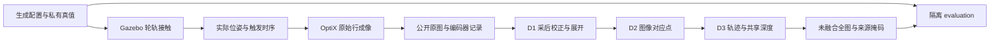

# 隧道轨道巡检与旋转线阵重建设计

版本 v0.13，更新 2026-10-05。本文定义现行范围、输入边界和规范目录；详细设计按主题拆分。原 § 编号保留，整理前全文见 [快照](docs/history/DESIGN_SNAPSHOT_2026-10-05.md)。

## 1. 目标与范围

约 120 kg 轨道车沿直轨行驶，线阵相机与 COB 条光共轴连续旋转，编码器逐行触发。完成 20 m 有效区、上方 240° 的采集和内壁全图复原；采集角 250°，每侧 5° 用于保护与共同观测支撑。全图必须保留掩码和原始来源，不能补洞伪装覆盖。

20 m 综合误差里程碑已收尾，见 [正式结果](docs/MILESTONE_20M.md)。后续最多扩展到 50 m，尚未建模和验收。底部 120°、两侧面阵相机、裂缝自动识别与精密三维测量不属于当前交付。

## 2. 平台选择与总体架构

Gazebo 负责真实轮轨接触和姿态，OptiX 负责线阵成像，ROS 2 / RViz 负责显示及任务控制。动力学按仿真时钟输出位姿流，成像按独立曝光时刻批量追踪，允许落后排空；不跳行或改时间戳。GUI 的光照与轻量贴图不决定采集图像质量。

**生产重建只能输入机器人能获得的信息**：原图、曝光/门控、扫描与双测量轮编码器、名义配置、标定影像估计结果。实际轮径、固定安装、仿真姿态、真实网格、缺陷位置和随机种子只供生成与隔离评价。RViz / TF 展示姿态不输入重建；暂不加 IMU。公开输入审计及其覆盖边界见 [验收协议](docs/EVALUATION.md)。

## 3. 参数基线与确定程度

| 项目 | 现行基线 |
|---|---|
| 内壁 | 半径 2.75 m，有效 [0,20] m；构造区 [−2.5,22.5] m |
| 相机 | Mono8，4096 像素，7.04 µm 像元，90 mm 镜头 |
| 运动 | 0.2 m/s 名义巡航，**估计**里程 0.6 m/圈 |
| 触发 | 2500 PPR，AB 四边沿，×128÷15；名义 28.444 kHz |
| 门控 | 初始朝下，−125°～+125° 采集；固定输出 −120°～+120° |
| 光学 | 8 µs 曝光，边缘 +0.6% 假设畸变，响应增益 2.4 |
| 原图／输出网格 | 约 0.208 mm 轴向、0.2025 mm 周向；输出 0.2 mm |

原始分辨率、安装估值、硬件固件核对项及公式见 [§3–4 详细参数](docs/design/GEOMETRY.md)。默认包与综合包的区别见 [误差场景](docs/ERROR_SCENARIOS.md)。

## 4. 扫描几何、行频和速度

坐标 x 沿轨道、y 横向、z 向上，θ=0 指向顶部。等效投影中心在旋转轴上，不把镜头前表面或传感器面当作旋转中心。扫描伺服跟随估计里程；轮径偏差使真实螺距偏离 0.6 m。倍频产生曝光时刻，不增加独立位置测量。公式及安装误差可观测性见 [§4](docs/design/GEOMETRY.md#4-扫描几何行频和速度)。

## 5. 轨道车与执行机构

前轮驱动、后轮承重从动，后方两只 80 mm 测量轮编码；轮轨接触、摩擦与导向约束实际参与动力学。车体横滚、俯仰与升沉由轨道起伏和接触产生。结构、停车与位姿流见 [§5](docs/design/SIMULATION.md#5-轨道车与执行机构)。

## 6. 隧道、轨道与缺陷场景

Concrete034 高清细节按配方分块生成，叠加低频变化；真实网格包含管片、板缝和填缝。裂缝采用 80% 细长、15% 细短、5% 网状，体宽截断正态 0.2–0.6 mm；不等同于可从照片可靠测得该宽度。几何与资源约束见 [§6](docs/design/SIMULATION.md#6-隧道轨道与缺陷场景)。

## 7. 条形光源与相机成像

20×20 mm COB、80×80 mm 散热器及特制透镜与相机一起转动。GUI 扫描光源投射机器人阴影；OptiX 成像当前未加入机器人自身遮挡。噪声可开关且参数是假设；镜头 MTF/离焦尚未实现。照明、畸变、采样和预览见 [§7](docs/design/SIMULATION.md#7-条形光源与相机成像)。

## 8. 编码器、时序与数据链路

按真实轴运动产生量化边沿，经因果倍分频与门控生成曝光。缓冲有界，失败停止后续输入；收尾完成排空与耐久提交后才标记完成。使用大块顺序 I/O，禁止逐行同步和高频遍历。HMAC 光学身份不公开私有密钥。详细接口见 [§8](docs/design/SIMULATION.md#8-编码器时序与数据链路)。

## 9. 拼接与全局优化

D1 将标靶估计的暗场/平场和畸变映射合并进采后展开，原图不变；D2 从公开图像建立对应点，避开凹槽特征的退化但不删评价板缝；D3 使用连续姿态、慢变平移、相对编码器尺度和固定轴方向，再估计共享径向深度。没有逐窗自由拉伸或真实外参输入。模型与可观测性见 [重建设计](docs/design/RECONSTRUCTION.md)，CLI 操作见 [STAGE_D](docs/STAGE_D.md)。

## 10. 数据量与输出格式

原始 Mono8 和元数据分块保存；D1 索引仍依赖原图。输出未融合全图、覆盖次数、来源、无效掩码、轨迹及质量报告。20 m 输出 57,596×100,000 像素；整幅图按块生成，不一次驻留内存。存储约束见 [重建设计](docs/design/RECONSTRUCTION.md#10-数据量与输出格式)，保留范围见 [DATA_RETENTION](docs/DATA_RETENTION.md)。

## 11. 性能设计与复用边界

质量优先，0.2 m/s 下联合 GUI 成像实时率目标 ≥0.6。CUDA 执行成像、展开、光线残差/雅可比和全图反采样；CPU 执行匹配调度及稀疏有界求解。动力学、成像、收尾与离线阶段分别计时；不通过删点或降低采样提速。当前实测见 [性能](docs/D3_PERFORMANCE.md)。

## 12. 开发守则

遵守 [DEVELOPMENT_RULES](docs/DEVELOPMENT_RULES.md)：读现有代码、提交后完整构建、冻结参数后在未调参区段/种子验证、独立重成像、真值隔离、保留首次失败。文档提交也影响构建身份。历史快照不作为现行任务入口。

## 13. 实施阶段与验收

| 阶段 | 当前状态与操作文档 |
|---|---|
| A 几何与时序 | 解析圆柱基线已验收；性能不外推到真实材质 |
| B 场景与光学 | [STAGE_B](docs/STAGE_B.md)：现行资产、标定、照明与限制 |
| C 原始采集与任务 | [STAGE_C](docs/STAGE_C.md)：壁面目标、编码器停车与联合 GUI |
| D 展开、匹配、优化、成图 | [STAGE_D](docs/STAGE_D.md)：20 m 综合场景已收尾 |

主接缝门限为窗口内/间两组 P95≤1 个 0.2 mm 输出像素，计划点不得缺测，完整输出不得有覆盖空洞；整体尺度工程目标≤0.5%。这些是项目工程门限，不是行业标准，也不保证每点≤1 px或可靠亚像素测宽。整图漂移、板缝形状、长细裂缝另报诊断，见 [EVALUATION](docs/EVALUATION.md) 和 [MILESTONE_20M](docs/MILESTONE_20M.md)。融合默认关闭，不代替几何验收。

## 14. 后续与已知缺口

50 m 先处理容量和分段求解，不直接生成大任务。机器人自身光学遮挡、真实镜头 MTF/离焦、真机噪声/刚度标定、弯轨和可靠照片测宽仍未完成。部分绝对位置、尺度与方向存在规范耦合；相对接缝通过不证明真实机械外参恢复。见 [ROADMAP](docs/ROADMAP.md)。

## 15. 参考资料

专利、相邻项目经验及原始来源集中在 [REFERENCES](docs/design/REFERENCES.md)。工程初值、用户确认值和设备实测值必须分别声明。
