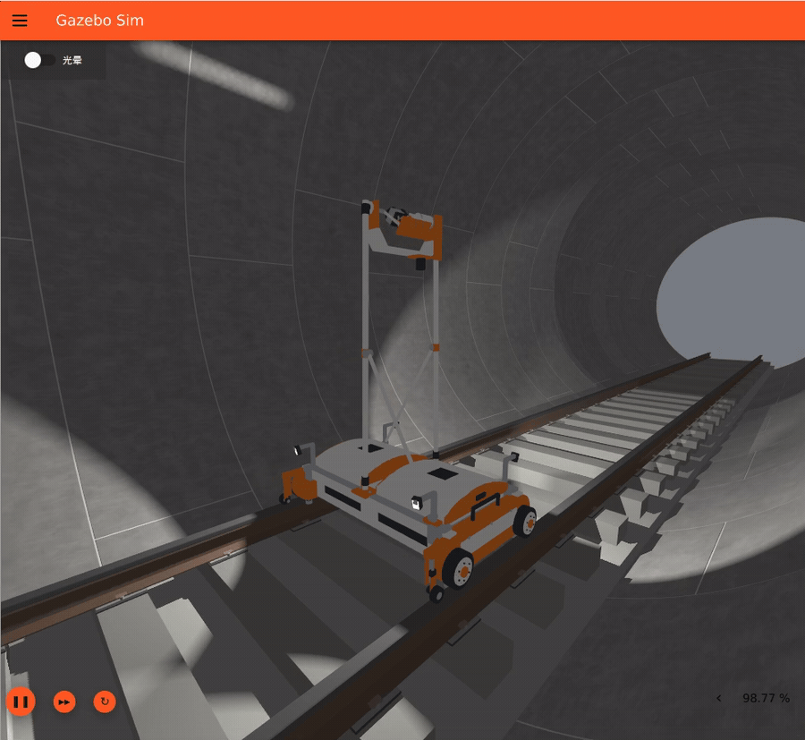
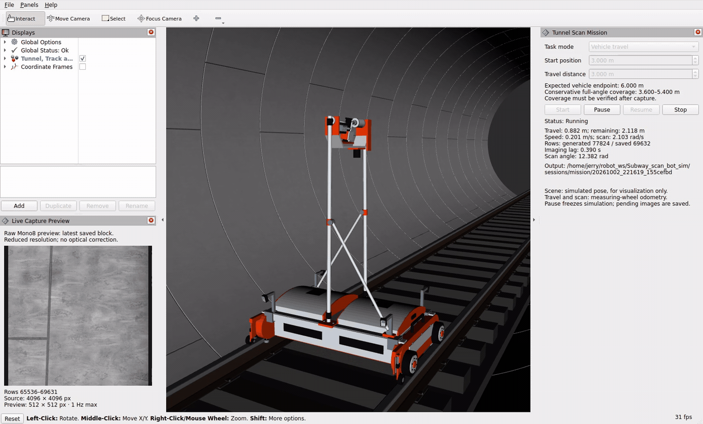
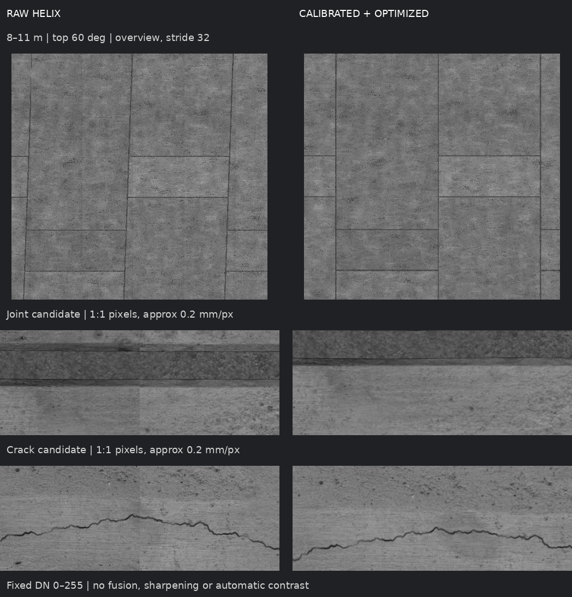

# 地铁隧道轨道巡检机器人仿真

轨道车沿钢轨前进，线阵相机与 COB 光源共同旋转，编码器逐行触发，形成连续螺旋扫描。Gazebo 负责轮轨接触与运动，OptiX 负责高速成像，ROS 2 / RViz 提供任务控制；采后通过标定、展开、特征匹配和全局优化复原隧道内壁。

已完成 20 米采集、CUDA 展开、匹配、连续轨迹优化与公开图像估计的板缝深度补偿。修复首尾曝光裁切后，新轨道种子的 **3 米轮径误差**和**20 米带噪声**独立验收均通过：窗口内／间接缝 P95 分别为 **0.475／0.645 px**、**0.626／0.674 px**，计划点零缺测。新采 20 米生成了 **57.596 亿像素**优化整图，完整覆盖无缺口，见 [当前证据](docs/EVALUATION.md)。保留轨道起伏和车体小姿态变化；拼接不读取仿真真值；[受限亮度与窄带融合](docs/SEAM_FUSION.md) 已通过完整 20 米回归与新种子 3 米验证，保留未融合对照。后续最多扩展到 **50 米**。

## 运行效果

### Gazebo：轮轨接触与旋转扫描



[高清静态图](docs/media/gazebo.png)

### RViz：任务控制与原图预览



[高清静态图](docs/media/rviz.png)

动图来自实际任务的视频录制，展示历史界面和机构运动；当前增益已改为用户确认的 2.4 并重新标定，旧动图不作为新画质或性能证据。来源见 [媒体说明](docs/media/README.md)。

## 原始倾斜条带与重建结果



来自代码 `7abfc5b` 冻结后独立采集的种子 20261029：真实测量轮 81 mm、标定轮径 80 mm，有轨道起伏，噪声关闭，增益 2.4。上部为 8–11 米顶部约 60° 区域，下部为公开图像选出的板缝、裂缝原尺度局部。左侧固定摆放原始条带，**不补偿螺旋位移、畸变或平场**；右侧包含采后校正、展开、匹配、全局优化和共享深度。固定 DN 0–255，无融合、锐化或自动对比度。

螺旋倾斜主要由展开消除，优化修正剩余接缝误差；定量基线为名义展开。这批窗口内／间 P95 为 **0.475／0.645 px**，不表示每点都 ≤1 px。完整局部图和来源见 [媒体说明](docs/media/README.md#重建对比图片2026-10-04)。

## 当前参数

| 项目 | 设置 |
|---|---|
| 隧道 | 有效 20 m、半径 2.75 m，两端各含 2.5 m 缓冲 |
| 轨道车 | 约 120 kg；前轮驱动、后轮从动，双 80 mm 测量轮编码器 |
| 相机 / 镜头 | Mono8、4096 像素、90 mm，0.6% 仿真畸变 |
| 运动 / 触发 | 0.2 m/s，估计里程 0.6 m/圈；名义约 28.444 kHz |
| 扫描范围 | 采集 250°，输出上方 240°，每侧 5° 保护区 |
| 壁面 | Concrete034 背景、砂浆板缝、0.2–0.6 mm 裂缝 |
| 误差与噪声 | 默认有轨道起伏；轮径＋偏移＋双轴倾斜＋噪声的综合 3 m、20 m 新采已通过，50 m 待验收；噪声默认关闭 |

真实轮径和标定轮径分开配置；默认均为 80 mm；另有 79、81 mm 受控场景。扫描与新任务停车跟随估计里程；轮径试验见 [WHEEL_ERROR](docs/WHEEL_ERROR.md)，固定装配组合见 [MOUNT_ERROR](docs/MOUNT_ERROR.md)。最新 [20 m 综合误差新采](docs/RELATIVE_SCALE.md#独立-20-m-综合验收2026-10-05) 同时加入 81/80 mm 轮径、偏移、双轴倾斜、起伏及噪声，接缝 P95 **0.607／0.662 px**、整图零缺口；headless 成像实时率约 0.986。[D3 同数据提速](docs/D3_PERFORMANCE.md) 两轮将位姿阶段由 452 降到 316，再降至 **99 秒**；同版本融合 CPU 为 137 秒，CUDA 再缩短约 27%，保持精度与完整覆盖。接缝窄带融合已完成，下一步规划 50 米分段，见 [计划](docs/ROADMAP.md)。暂不加 IMU。

## 安装：WSL 与原生 Linux 分开选择

公共依赖为 Ubuntu 24.04、ROS 2 Jazzy、Gazebo Harmonic、CUDA Toolkit 12.8、OptiX SDK 9.1.0 和系统 Python 3.12。完整验收来自 WSL / RTX 5080；原生 Linux 整套验收尚未完成。

| 环境 | 安装及启动路径 |
|---|---|
| WSL2 / WSLg | Windows NVIDIA 驱动、CUDA Toolkit、隔离 OptiX 组件和私有 Mesa；不要在 WSL 安装 Linux 显卡驱动。见 [WSL 部署](docs/DEPLOYMENT.md#路线一wsl2--wslg) |
| 原生 Ubuntu | 系统 NVIDIA / OpenGL / OptiX 运行库，不加载 WSL 组件；见 [原生部署](docs/DEPLOYMENT.md#路线二原生-ubuntu-linux) 和 [原生启动](docs/DEPLOYMENT.md#原生-linux-启动) |

先按 [公共依赖安装](docs/DEPLOYMENT.md#两种环境共用ros依赖和源码) 完成软件源、系统包及 SDK，再克隆构建：

```bash
mkdir -p ~/robot_ws
cd ~/robot_ws
git clone https://github.com/chubbyk-uu/rail-tunnel-linescan-sim.git Subway_scan_bot_sim
cd Subway_scan_bot_sim
source /opt/ros/jazzy/setup.bash
export COLCON_DEFAULTS_FILE="$PWD/colcon_defaults.yaml"
colcon build > /tmp/ssb_build.log 2>&1
source install/setup.bash
```

后续命令在仓库根目录执行。修改源码或更新 Git 提交后，采集前重建，包括文档提交。按环境选择实际射线后端自检：

```bash
# WSL
bash tools/with_optix_runtime.sh install/ssb_core/lib/ssb_core/ssb_selfcheck \
  src/ssb_core/config/stage_a.yaml > /tmp/ssb_selfcheck.log 2>&1
# 原生 Linux：直接运行系统后端，不加载 WSL 包装器。
install/ssb_core/lib/ssb_core/ssb_selfcheck \
  src/ssb_core/config/stage_a.yaml > /tmp/ssb_selfcheck.log 2>&1
```

仅运行对应的一条。其他 SDK 路径、WSL 运行库和 Mesa 的获取、自检失败处理见 [完整部署文档](docs/DEPLOYMENT.md)。WSL 数据放 `/home` 等 Linux 文件系统，避免在 `/mnt/c` 高频读写。

## 从网站下载并生成演示资产

不需要从旧机器拷贝。主背景来自 [Concrete034](https://ambientcg.com/view?id=Concrete034)，低频变化与砂浆来源见 [官方下载规格](docs/ASSETS.md#1-公开素材与下载规格)。下载器支持当前终端的代理配置，校验文件哈希；默认下载约 652 MB。

```bash
python3 tools/download_demo_sources.py --output local_data/stage_b/sources \
  > /tmp/ssb_download.log 2>&1
# WSL：work/output 必须是新的目录。
python3 tools/build_demo_from_sources.py --runtime wsl \
  --sources local_data/stage_b/sources \
  --work local_data/stage_b/build_NEW \
  --output local_data/stage_b/contact_demo_buffered > /tmp/ssb_assets.log 2>&1
```

生成内容含隧道、材质、裂缝、轨道车、世界、独立标靶及图像标定。原生 Linux 将 `--runtime wsl` 改为 `--runtime native`，该路线尚未在独立主机完整验收。网站手动下载、输出结构和生成边界见 [ASSETS](docs/ASSETS.md)。生成成功后仍需短程采集验证。

## 快速采集

### WSL：Gazebo + RViz

```bash
tools/run_mission.sh --gz-gui > /tmp/ssb_mission.log 2>&1
```

在 RViz 面板选择 **Wall coverage**，设置起点和壁面长度，点击 **Start**；支持暂停、继续和停止。最短任务 1 m。设置任务后车辆初始化到规划起点，壁面模式会自动增加前后超扫。**Vehicle travel** 是车体行程模式，不是当前正式重建入口。采集只保存原始图像，预览不做畸变或平场补偿。

### WSL：无界面壁面任务

```bash
bash tools/run_wall_capture.sh sessions/wall_NEW 12 3 \
  > /tmp/ssb_capture.log 2>&1
```

目标为壁面 `[12,15] m`，会话和派生输入目录必须是新的。只开 Gazebo 可用 `tools/run_gz_gui.sh`。**这些启动器默认面向 WSL**；原生 Linux 请使用 [独立启动步骤](docs/DEPLOYMENT.md#原生-linux-启动)，不要直接套用 WSL 包装器。

## 重建与看图

使用该会话光学条件对应的标定，输出目录均须是新的。下面从原始行完成采后校正、展开和公开输入匹配优化：

```bash
python3 -m ssb_tools.initial_unroll --session sessions/wall_NEW \
  --calibration local_data/stage_b/contact_demo_buffered/calibration.json \
  --backend cuda --output sessions/d1_NEW > /tmp/ssb_d1.log 2>&1
python3 -m ssb_tools.public_reconstruction \
  --unroll sessions/d1_NEW \
  --observable sessions/wall_NEW/config/observable_config.json \
  --root sessions/reconstruction_NEW --surface-relief --strict > /tmp/ssb_reconstruction.log 2>&1
python3 -m ssb_tools.feature_review \
  --unroll sessions/d1_NEW --trajectory sessions/reconstruction_NEW/fit \
  --observable sessions/wall_NEW/config/observable_config.json \
  --output sessions/review_NEW > /tmp/ssb_review.log 2>&1
python3 -m http.server 8765 --bind 0.0.0.0 --directory sessions/review_NEW
```

打开 `http://localhost:8765/review.html`；WSL 转发不可用时改用 `hostname -I` 的地址。页面保留原始条带、名义展开和优化三种状态，以及板缝/裂缝局部。详细参数、搬家后的原图定位、全分辨率输出与资源见 [重建文档](docs/STAGE_D.md)。

D1 默认产物约 25 MB / 3 m、137 MB / 20 m，仍依赖原图；不要因此删除采集块。3 m 名义/优化全图另需约 4.8 GiB。正式默认输出为优化后未融合图；[接缝融合](docs/SEAM_FUSION.md) 可选、默认关闭，需要时单独运行。不补洞；真值只进入生成与 `evaluation/`，RViz 显示姿态不作为拼接输入。

## 验收、测试与排障

正式冻结采集、独立重成像、协议核验（v6 为 15 项，含共享深度的 v7 为 16 项）和网格评价见 [EVALUATION](docs/EVALUATION.md)。阶段 B 报告禁止覆盖，复查用 `--read-only` 或新报告路径；已去重副本的比对不是新的独立验证。

```bash
python3 tools/run_tests.py > /tmp/ssb_test.log 2>&1
colcon test-result --all
```

当前完整回归 **723 项通过，无失败/跳过**，其中 Python 639 项；实际采集、故障注入与独立评价另行执行，结果见验收文档。生产 D2/评价默认最多 8 个可用 CPU，测试入口默认 4 个工作进程。原生 GPU 测试边界见部署文档。

| 现象 | 检查 |
|---|---|
| 资产缺失 / 哈希不匹配 | 按 ASSETS 下载和生成成套包，不随意删依赖 |
| OptiX 或 GUI 启动失败 | 检查对应平台运行库、WSL Mesa 和实际射线自检 |
| 构建 / 标定身份不匹配 | 重建，加载当前 install；配置与标定必须成套 |
| RViz 纹理不够清楚 | 它是轻量预览，画质看原尺度采集图 |
| 收尾仍在排空 | 等完成状态并看日志，这不代表车辆继续行驶 |

## 文档导航

| 文档 | 内容 |
|---|---|
| [DESIGN](DESIGN.md) | 统一设计规范、几何、时序与可观测性 |
| [DEPLOYMENT](docs/DEPLOYMENT.md) / [ASSETS](docs/ASSETS.md) | 环境安装、从官网下载并生成资产 |
| [STAGE_B](docs/STAGE_B.md) / [STAGE_C](docs/STAGE_C.md) | 场景操作、名义壁面任务与历史 20 m 采集记录 |
| [STAGE_D](docs/STAGE_D.md) / [EVALUATION](docs/EVALUATION.md) | 现行重建流程、验收协议与证据 |
| [WHEEL_ERROR](docs/WHEEL_ERROR.md) | 编码器里程停车与三档轮径误差试验 |
| [ROADMAP](docs/ROADMAP.md) | 停车、轮径、扫描轴误差、融合及 50 m 扩展 |
| [SENSOR_NOISE](docs/SENSOR_NOISE.md) | 可选噪声模型，参数为仿真假设 |
| [DEVELOPMENT_RULES](docs/DEVELOPMENT_RULES.md) | 开发、真值隔离与 WSL I/O 约束 |
| [DATA_RETENTION](docs/DATA_RETENTION.md) / [历史资料](docs/history/README.md) | 当前保留范围、清理和开发归档 |

`src/ssb_core` 为时序/成像/存储，`ssb_gazebo` 为动力学与 GUI，`ssb_rviz` 为任务面板，`ssb_tools` 为生成、标定和重建。资产、会话、构建及日志目录不进 Git。
