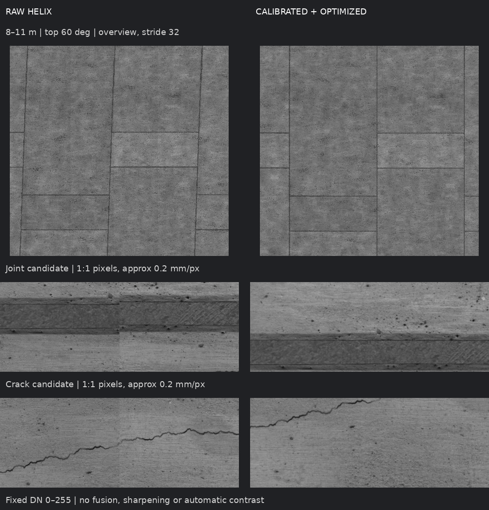

# 扫描轴固定安装误差

本页记录 ROADMAP 第 3 项。横滚/俯仰随起伏轨道变化，固定安装误差则始终存在；两者分别建模。初始敏感性量级为横向/竖向 ±20 mm、轴线绕 y/z 的 ±1 mrad，不代表实测装配公差。下文两组固定装配验收不含轮径偏差或噪声；随后同量级叠加轮径、起伏及噪声的新采已通过，独立记录见 [COMBINED_ERROR](COMBINED_ERROR.md)，不改写本页原批次的范围。

## 装配与成像

世界生成器将头部、轴承、固定扫描架、滑环定子一起平移/倾斜。光源与相机仍共用旋转头；扫描轴在头部坐标系中为 `-x`，正编码器角对应 `Rx(-theta)`。变换顺序为车体姿态、固定安装 `Rz(tilt_z) Ry(tilt_y)`、扫描旋转。安装点相对车体的偏移随车体一起旋转，不能在世界坐标中直接叠加，也不能将安装倾斜再次加到扫描角。

启动检查同时核对位置、方向和关节轴；Python 物理一致性检查还核对归档装配。历史名义装配的 manifest 没有新装配项时仍必须直接核对配置，不能跳过。

生成入口：`tools/prepare_contact_demo.py --mount-offset-mm DY DZ --mount-tilt-mrad Y Z --calibrate`。参数仅进入生成端的 `truth.mount`，需要重新生成世界；不能修改既有会话或只改成像配置。

## 独立标定夹具

外部安装条件改变后，原光学签名不匹配，不能复制旧签名绕过校验。标定时将相机/共转光源装入独立的居中、对准且距离已知的夹具；生成端用夹具姿态取消车体安装变换。镜头畸变、响应和传感器噪声保留，签名仍由原始配置计算。

`ssb_probe --centered-bench` 仅用于静止标定靶，不用于采集、重成像或重建。其夹具位姿不进入校正文件；校正仍只由暗场、均匀场、条纹及独立留出靶图估计。标定恢复的是镜头映射和平场，**没有提供车体上的安装偏移/方向**。目前只支持扫描轴偏移/倾斜，光心偏离转轴及线阵扭转仍待单独设计。

## 验证要求

四种单项的 3 m 开发验证已经完成，只用于定位模型问题。按用户 2026-10-04 的要求，取消九组单项正负新采，正式验收只做两组：名义装配对照，以及偏移和倾斜同时存在的组合装配。两组使用同一未调参轨道种子 20261103、区段 [8,11] m、2 mm 纵向起伏及 2 mm 水平差，保留实际接触导致的车体横滚/俯仰。

组合固定参数为横向 +20 mm、竖向 −20 mm、绕 y +1 mrad、绕 z −1 mrad。名义对照固定安装误差为零；两组真实/标定测量轮均为 80 mm、响应增益 2.4、噪声关闭，以隔离组合装配影响。轮径误差与噪声的叠加属于后续验证，不据此宣称已覆盖。只有组合失败才补针对性的诊断，不默认展开完整参数矩阵。

方法与参数先冻结，采集必须完整构建、装配一致、独立重成像逐字节一致；公开输入审计无违规。接缝仍使用预声明的窗口内/窗口间两组点，P95 ≤1 px，计划点零缺测，板缝不剔除。失败数据保留，两组通过不表示所有偏差幅度或符号均通过。

现有 D3 的四场运动模型不等于完整的固定外参标定。需用实际误差场景检查可表达性和可观测性；不能因增加自由度后留出残差下降就宣称恢复真实安装参数。绝对位置、共同尺度及部分方向与坐标规范耦合，固定名义半径/独立镜头标定先验，并明确结论限于相对接缝与覆盖。

## 图像模型与求解

原四场模型在 +20 mm 横向偏移开发数据上触及参数边界，不能表达足够的横向位置变化；不是通过提高迭代上限解决。`--slow-translation` 在原四场上增加横向/升沉修正，使用 0.6 m 的粗节点，位置界限 ±30 mm、名义先验 10 mm。细姿态节点仍是 0.02 m，并保留仅由训练残差驱动的有界加密；两种节点不能混用曲率尺度。该模式只看公开图像对应点，参数与取点在正式采集前冻结。

圆柱坐标中，共同横滚与共同横向/竖向偏移可以交换，同时旋转输出 q 坐标，绝对姿态不因此可观测。以公开编码器区间的中点定义输出坐标方向，对该点横滚锚定；采用局部四个样条基函数，不构造会填满矩阵的全节点均值。仍不宣称恢复真实固定安装参数、绝对位置或轴线方向。

有界牛顿步改为求解耦合的盒约束二次问题；直接逐项截断无约束步不满足边界上的最优条件。外层 50 步上限、IRLS 次数、采样和接缝门限不变。独立穷举 KKT 活跃面测试用于核对边界解。法方程的数值累加采用不访问文件的 CPU 核心，仅输入公开 Jacobian/残差；固定行块、顺序归约，稠密核暂存限制 192 MiB，稀疏结果另计入 RSS。来源协议同时绑定该库的哈希。

当前状态：装配与标定夹具已实现，真实 Gazebo 的 17 组插件回归和完整 780 项测试通过。加速版四个单项开发场景均通过接缝及四边支撑：横向/竖向 +20 mm、绕 y/z 各 +1 mrad 的窗口间 P95 分别为 0.777 / 0.794 / 0.812 / 0.827 px，计划点零缺测。它们是已见数据，不能代替冻结后的组合新采验收。名义对照与组合新采已通过，正式结果如下。


## 两组新采结果

代码 `a242518` 冻结后，以种子 20261103、[8,11] m 独立新采，两组各 25 项阶段 B、17 项协议核验（含数值核哈希）及公开输入审计通过。二进制与源码一致，实际独立重成像逐字节相同，私有输入读取为零。每组 1,238 个计划窗口、11,142 个接缝点，窗口内/间均零缺测。

| 场景 | 名义展开 P95：窗口内 / 间 | 优化后 P95：窗口内 / 间 |
|---|---|---|
| 名义装配 + 起伏轨道 | 16.694 / 16.668 px | **0.510 / 0.573 px** |
| 四项固定安装误差 + 起伏轨道 | 41.612 / 40.772 px | **0.394 / 0.428 px** |

组合结果完整 240°、3 m 全图共 863,940,000 像素，覆盖缺口为零；完整保存值/覆盖游程一致，84 个 CPU 参考点（含 16 个非零深度探针）量化码差为零。位姿优化约 45.50 s、径向深度另计；完整 CUDA 成图约 57.26 s，进程峰值约 652 MiB。组合采集的动力学/成像进度实时率约 1.000 / 0.980，是 headless 实测，不是 GUI 性能证明。

接缝 P95 通过不等于每点误差小于 1 px：组合窗口间 P99 约 3.45 px、最大约 5.04 px。绝对位置/姿态仍受坐标规范与先验约束，不宣称恢复了真实安装外参。当前结论限于上述组合、区段及轨道种子；轮径偏差、噪声与长距离组合仍待验证。

证据：`sessions/mount_combined_holdout_20261004/{nominal,combined}/` 及同名 `local_data/evaluation/`。最新组合的原始图、独立重成像、完整优化图、公开复核页和首次评价报告保留；不用旧单项通过替代这两次新采。清理说明见 [DATA_RETENTION](DATA_RETENTION.md)。



左侧未补偿螺旋、畸变和平场；右侧包含采后校正、展开、匹配、全局优化及共享深度。局部按公开图像的首个板缝/裂缝候选选择，未按真值误差挑图；源面板逐像素一致，无融合或锐化。定量基线是表中的名义展开，不把去螺旋效果全部归于优化。

复现对应资产时，先按 [DEPLOYMENT](DEPLOYMENT.md) 从公开素材生成 `contact_demo`，然后生成并导出组合包。以下目录须为新的，源码须已提交，ROS 与工作区环境须已加载：

```bash
python3 tools/prepare_contact_demo.py --demo local_data/stage_b/contact_demo \
  --output local_data/stage_b/COMBINED_PREPARED_NEW \
  --mount-offset-mm 20 -20 --mount-tilt-mrad 1 -1 \
  --track-chord-mm 2 --track-cross-level-mm 2 --track-seed 20261103 --calibrate
python3 -m ssb_tools.demo_bundle --demo local_data/stage_b/COMBINED_PREPARED_NEW \
  --output local_data/stage_b/COMBINED_BUNDLE_NEW
SSB_OFFLINE_WORKERS=4 SSB_D2_SPACING_M=.1 SSB_D2_HEIGHT=256 \
SSB_D2_Q_SHIFT_MM=10 SSB_ADAPTIVE_ATTITUDE=1 SSB_SURFACE_RELIEF=1 \
SSB_SLOW_TRANSLATION=1 bash tools/run_d3_holdout.sh \
  sessions/COMBINED_NEW local_data/evaluation/COMBINED_NEW \
  8 3 local_data/stage_b/COMBINED_BUNDLE_NEW
```

同种子复跑属于复现；未来修改方法后，需要另选未参与调参的种子验收。
